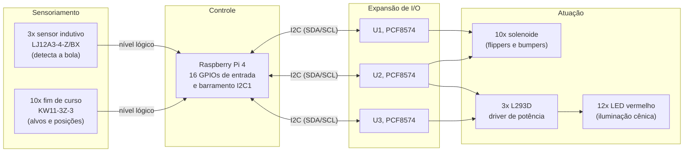

# PJI-II Pinball IFSC

Documentação técnica do pinball desenvolvido na disciplina de Projeto Integrador II do curso de
Engenharia de Telecomunicações do IFSC, Campus São José.

Este repositório dá continuidade ao trabalho da turma anterior. O foco aqui é registrar o que
existe, como está ligado, por que foi feito dessa forma e o que ainda falta, de modo que quem
assumir o projeto não precise reconstruir esse entendimento a partir do esquemático.

## Estado atual

O pinball ainda não está funcional. A etapa anterior entregou a arquitetura eletrônica (esquemático
e simulação), as classes básicas de acesso ao hardware em Python e boa parte das peças mecânicas
impressas em 3D. A lógica de jogo não foi implementada.

| Frente | Situação |
|---|---|
| Mecânica (estrutura, flippers, bumpers, injetor) | Parcial: peças modeladas e impressas, montagem incompleta |
| Hardware (esquemático e simulação Proteus) | Parcial: projetado e simulado, com erros conhecidos |
| Software (acesso ao hardware) | Parcial: classes `Raspberry` e `Pcf8574` funcionando |
| Software (lógica do jogo) | Não iniciado |
| Montagem e integração final | Não iniciado |

Vale destacar um ponto: o esquemático tem um erro de endereçamento I²C que provavelmente é a causa
das falhas intermitentes de comunicação relatadas no relatório anterior. O diagnóstico está em
[Pendências, item P1](docs/09-pendencias-e-roadmap.md).

## Documentação

| Documento | Conteúdo |
|---|---|
| [01. Visão geral](docs/01-visao-geral.md) | Objetivo, escopo, decisões de arquitetura e glossário |
| [02. Arquitetura de hardware](docs/02-arquitetura-hardware.md) | Topologia do sistema, barramentos e alimentação |
| [03. Componentes](docs/03-componentes.md) | Cada componente do projeto, o que é e como é usado |
| [04. Circuitos integrados](docs/04-circuitos-integrados.md) | PCF8574 e L293D em detalhe |
| [05. Pinagem e mapa de I/O](docs/05-pinout.md) | Tabelas pino a pino de todos os CIs |
| [06. Software](docs/06-software.md) | Estrutura do código, API das classes e como evoluir |
| [07. Mecânica](docs/07-mecanica.md) | Peças 3D, modelos de referência e processo |
| [08. Simulação no Proteus](docs/08-simulacao-proteus.md) | Como abrir e rodar a simulação |
| [09. Pendências e roadmap](docs/09-pendencias-e-roadmap.md) | Erros conhecidos e próximos passos |
| [10. Plano do semestre](docs/10-plano-do-semestre.md) | Calendário de aulas, sprints e riscos |
| [11. Ficha de levantamento](docs/11-ficha-de-levantamento.md) | Formulário a preencher no Sprint 0 |
| [10. Plano do semestre](docs/10-plano-do-semestre.md) | Cronograma 2026.2, sprints e riscos |

## Arquitetura em uma figura



A Raspberry Pi lê os sensores diretamente pelos GPIOs, o que mantém a latência baixa (importante
para os flippers), e comanda as cargas através de três expansores PCF8574 no barramento I²C, porque
a Pi não tem GPIOs suficientes para tudo. Os PCF8574 não fornecem corrente para acionar cargas, e é
aí que entram os L293D.

## Ferramentas

`tools/levantar_entradas.py` descobre qual sensor está ligado a qual GPIO, que é a pendência que
trava o resto do projeto. Roda na Raspberry Pi:

```bash
python3 tools/levantar_entradas.py monitor       # imprime toda mudança de estado
python3 tools/levantar_entradas.py identificar   # pede um sensor por vez e grava mapeamento.csv
```

## Organização do repositório

```
PJI-II-Pinball/
├── docs/                   documentação técnica
│   ├── 01-visao-geral.md
│   ├── ...
│   └── assets/             imagens e recortes do esquemático
├── tools/
│   └── levantar_entradas.py    levantamento do mapeamento sensor para GPIO
├── upstream/
│   └── pinball/            submódulo apontando para o repositório anterior
└── README.md
```

### Sobre o `upstream/pinball`

O trabalho da etapa anterior não foi copiado para cá. Ele está referenciado como submódulo Git
apontando para o repositório original,
[danieCFernandes/pinball](https://github.com/danieCFernandes/pinball), que contém o código-fonte, o
esquemático do Proteus e o relatório final daquela etapa.

Dessa forma o histórico e a autoria originais ficam preservados, e no GitHub a pasta
`upstream/pinball` aparece como um link direto para aquele repositório em vez de abrir uma árvore
de arquivos.

Para clonar este repositório junto com o conteúdo do submódulo:

```bash
git clone --recurse-submodules https://github.com/vgguerra/PJI-II-Pinball.git
```

Se você já clonou sem o `--recurse-submodules`:

```bash
git submodule update --init --recursive
```

Para atualizar a referência caso o repositório original receba novos commits:

```bash
git submodule update --remote upstream/pinball
git add upstream/pinball && git commit -m "Update upstream pinball reference"
```

## Créditos

Etapa anterior (2025/2), projeto de hardware, mecânica e drivers de software: Daniel Cardoso
Fernandes e Roberto da Silva Espindola. Orientação do Prof. Adilson Jair Cardoso.

Instituto Federal de Santa Catarina, Campus São José. Engenharia de Telecomunicações, Projeto
Integrador II.

## Licença

O repositório da etapa anterior declara a MIT License no README, mas não inclui o arquivo `LICENSE`.
Enquanto isso não for resolvido com os autores originais, a licença deste material deve ser
considerada indefinida. Ver [Pendências, item P8](docs/09-pendencias-e-roadmap.md).
