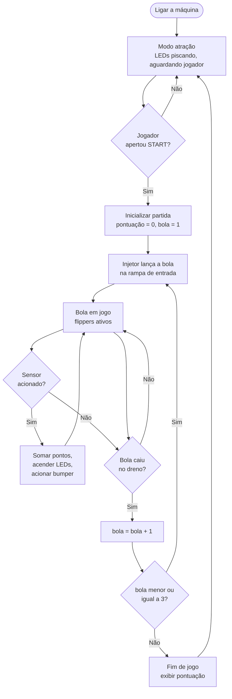

[Voltar ao índice](../README.md)

# 01. Visão geral

## 1.1 Objetivo

O projeto nasceu no contexto da Feira de Jogos do IFSC, Campus São José, um evento em que as turmas
de Projeto Integrador desenvolvem jogos físicos interativos. A proposta desta frente foi construir
uma máquina de pinball completa, do zero, usando apenas conhecimentos já adquiridos ao longo do
curso de Engenharia de Telecomunicações.

O pinball serve bem como projeto integrador porque exige, ao mesmo tempo, eletrônica digital
(sensores, atuadores, expansão de I/O, drivers de potência), sistemas embarcados (leitura de
sensores em tempo real, protocolos de comunicação), programação (máquina de estados do jogo,
pontuação, concorrência) e mecânica (estrutura, modelagem 3D, impressão aditiva, ajuste de
mecanismos móveis).

## 1.2 Escopo entregue pela etapa anterior

A equipe anterior, duas pessoas ao longo de um semestre, entregou quatro frentes.

O projeto mecânico inclui a modelagem 3D da mesa e dos obstáculos, com peças já impressas: bumpers,
flippers, injetor de bolas e repositor. Detalhes em [07. Mecânica](07-mecanica.md).

O projeto eletrônico é um esquemático completo feito no Proteus, com Raspberry Pi 4, três expansores
PCF8574, três drivers L293D, sensores e atuadores. Detalhes em
[02. Arquitetura de hardware](02-arquitetura-hardware.md).

A simulação validou a comunicação I²C entre a Raspberry Pi e o PCF8574 dentro do Proteus, antes da
montagem física. Detalhes em [08. Simulação no Proteus](08-simulacao-proteus.md).

Os drivers de software são duas classes Python, `Raspberry` e `Pcf8574`, que abstraem o acesso a
GPIO e I²C. Detalhes em [06. Software](06-software.md).

O que não foi entregue: a lógica do jogo, a integração final e a montagem completa da máquina.

## 1.3 Como um pinball funciona

Entender o fluxo do jogo é o que dá sentido a cada componente eletrônico do esquemático. O ciclo é
o seguinte.

Mapeando cada etapa para o hardware:

| Etapa do jogo | Componente responsável |
|---|---|
| Detectar que a bola passou por um ponto | Sensor indutivo `LJ12A3-4-Z/BX` |
| Detectar que a bola bateu num alvo | Fim de curso `KW11-3Z-3` |
| Ler o botão START e posições de mecanismos | Fim de curso `KW11-3Z-3` |
| Empurrar a bola (flipper, bumper, injetor) | Solenoide acionada via `PCF8574` |
| Iluminação cênica e feedback visual | LED vermelho acionado via `L293D` |
| Contar pontos e decidir o que acontece | Software na Raspberry Pi 4 |

## 1.4 Decisões de arquitetura e o porquê

**Raspberry Pi 4 como cérebro.** Roda Python direto, tem I²C nativo, facilita a depuração e abre
caminho para uma interface gráfica de placar mais adiante.

**Expansores PCF8574 no barramento I²C.** A Pi oferece cerca de 26 GPIOs úteis, e o pinball precisa
de mais de 40 pontos de I/O entre sensores, solenoides e luzes. Cada PCF8574 acrescenta 8 I/Os
usando apenas dois fios do barramento.

**Sensores ligados direto no GPIO, não via PCF8574.** A razão é latência. O flipper precisa
responder em milissegundos ao comando do jogador, e uma transação I²C acrescentaria atraso e jitter
no caminho crítico. Por isso os 13 sensores foram para GPIOs dedicados.

**Drivers L293D para as cargas.** O PCF8574 fornece corrente da ordem de poucos miliampères por
pino, insuficiente para acionar LEDs com brilho adequado e muito abaixo do necessário para
solenoides. O L293D resolve isso funcionando como estágio de potência.

**Migração planejada para RTOS em ESP32.** Python rodando sobre Linux não garante o determinismo
temporal que os flippers exigem. A conclusão da etapa anterior foi que a Pi deve cuidar da lógica
de alto nível e um microcontrolador com RTOS deve cuidar do tempo real. Ver
[09. Pendências e roadmap](09-pendencias-e-roadmap.md).

## 1.5 Glossário

| Termo | Significado |
|---|---|
| Flipper | O batedor acionado pelo jogador para rebater a bola |
| Bumper | Obstáculo circular que repele a bola ativamente e pontua |
| Dreno (drain) | Abertura no fundo da mesa por onde a bola é perdida |
| Injetor (ball launcher) | Mecanismo que coloca a bola em jogo |
| Modo atração (attract mode) | Estado de espera, com luzes e sons, para atrair jogadores |
| Solenoide | Atuador eletromagnético que puxa um núcleo metálico com força ao ser energizado |
| I²C | Barramento serial de dois fios, dados e clock, para comunicação entre CIs |
| GPIO | General Purpose Input/Output, pino digital genérico |
| Expansor de I/O | CI que acrescenta pinos digitais ao sistema através de um barramento serial |
| Pull-up | Resistor que mantém um sinal em nível alto quando nada o está forçando |
| RTOS | Real-Time Operating System, sistema operacional com prazos de resposta garantidos |
| Dreno de corrente (sink) | Saída que conduz corrente para o terra em vez de fornecê-la |

---

Próximo: [02. Arquitetura de hardware](02-arquitetura-hardware.md)
