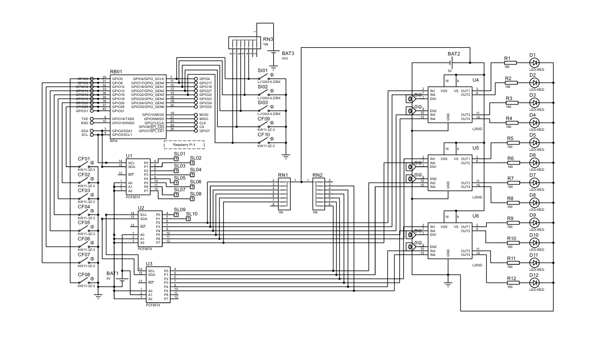
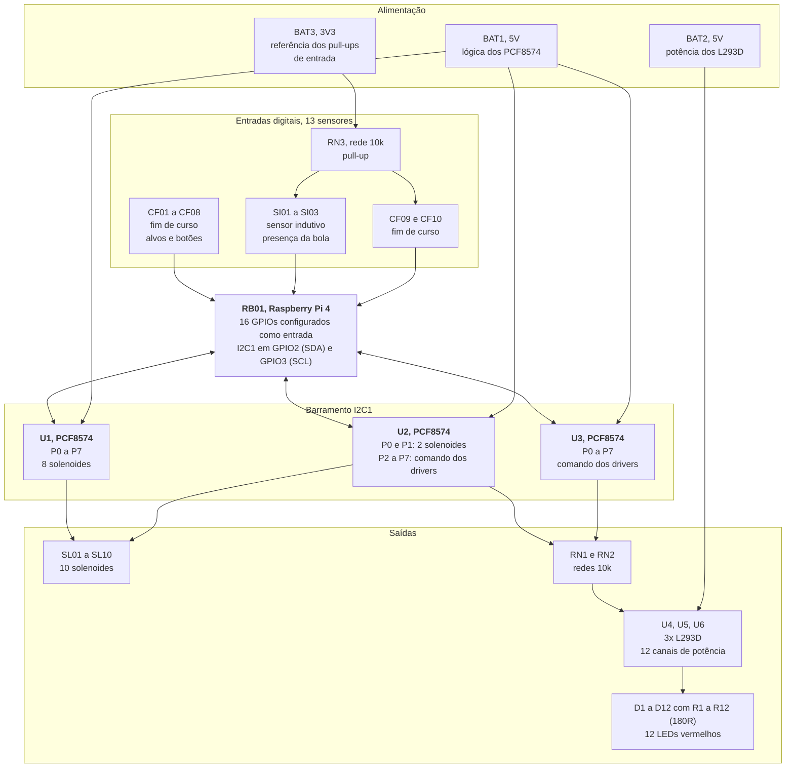
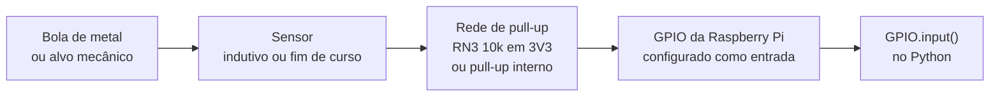
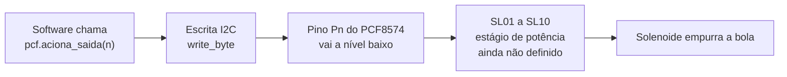
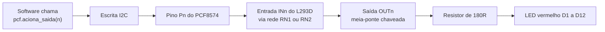
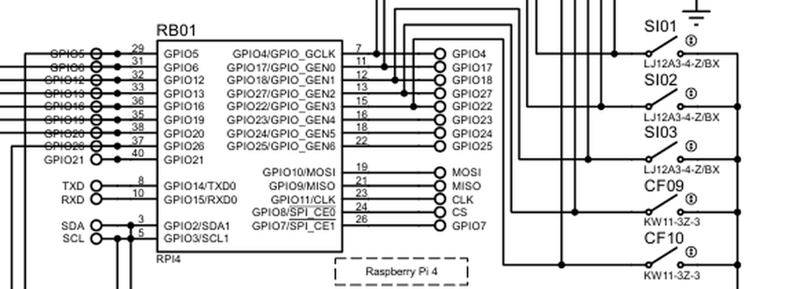
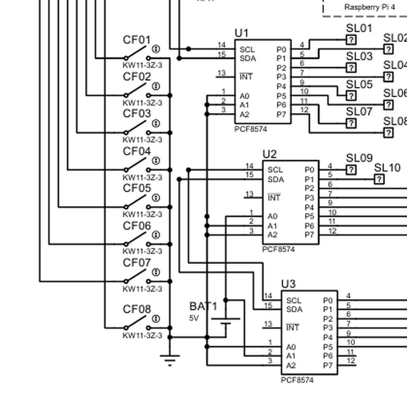
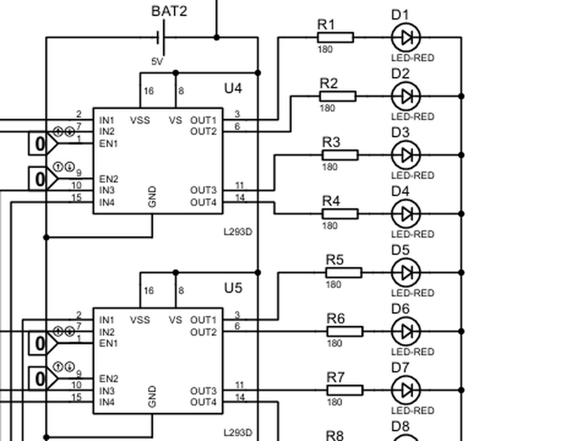

[Voltar ao índice](../README.md)

# 02. Arquitetura de hardware

## 2.1 Esquemático completo

O esquemático original está no projeto Proteus `hardware/diagrama-pinball.pdsprj` do repositório
anterior (acessível por [`upstream/pinball`](../upstream/pinball)). A figura abaixo é a exportação
que acompanha aquele repositório.

O esquemático se lê da esquerda para a direita em quatro blocos: as entradas (chaves de fim de curso
CF01 a CF08), o controlador (RB01, a Raspberry Pi 4) com os sensores do topo, os expansores de I/O
(U1, U2 e U3) e, à direita, o estágio de potência (U4, U5 e U6) com a carga de LEDs.

## 2.2 Topologia do sistema

## 2.3 Contagem de I/O

Este é o balanço que justifica a existência dos expansores.

| Função | Quantidade | Onde está ligado |
|---|---|---|
| Sensores de fim de curso | 10 (CF01 a CF10) | GPIO direto da Raspberry Pi |
| Sensores indutivos | 3 (SI01 a SI03) | GPIO direto da Raspberry Pi |
| Solenoides | 10 (SL01 a SL10) | U1 completo, mais P0 e P1 de U2 |
| Canais de LED | 12 (D1 a D12) | U4, U5 e U6, comandados por U2 e U3 |

Somando: 13 entradas nos GPIOs e 22 pontos de saída atendidos por 24 pinos de expansor. A Raspberry
Pi sozinha não daria conta das duas coisas, o que valida a decisão de expandir.

## 2.4 Barramento I²C

A comunicação usa o `I2C1` da Raspberry Pi, disponível nos pinos físicos 3 e 5:

| Sinal | GPIO (BCM) | Pino físico | Destino |
|---|---|---|---|
| SDA | GPIO2 | 3 | Pino 15 (SDA) de U1, U2 e U3 |
| SCL | GPIO3 | 5 | Pino 14 (SCL) de U1, U2 e U3 |

Os três PCF8574 compartilham o mesmo par de fios. O que deveria diferenciá-los é o endereço,
configurado nos pinos de seleção A0, A1 e A2 de cada CI.

> **Atenção.** No esquemático, os pinos A0, A1 e A2 dos três PCF8574 estão todos ligados no mesmo
> nó, e esse nó vai ao terra. Isso faz com que os três CIs respondam no endereço `0x20`
> simultaneamente, o que é um conflito de barramento. O diagnóstico completo e a correção estão em
> [09. Pendências, item P1](09-pendencias-e-roadmap.md). Trate as atribuições de U1, U2 e U3 nesta
> documentação como a intenção do projeto, não como algo que funcione da forma como está desenhado.

O esquemático também não mostra resistores de pull-up externos em SDA e SCL. Na prática a Raspberry
Pi tem pull-ups de 1,8k internos nesses dois pinos, o que costuma ser suficiente para trechos
curtos. Como o cabeamento dentro de uma mesa de pinball é longo e passa perto de solenoides, isso
merece verificação. Ver [P5](09-pendencias-e-roadmap.md).

## 2.5 Alimentação

O esquemático usa três fontes, representadas como baterias por ser um ambiente de simulação.

| Fonte | Tensão | O que alimenta |
|---|---|---|
| BAT1 | 5 V | Alimentação lógica dos três PCF8574 |
| BAT2 | 5 V | Pinos VSS (lógica) e VS (potência) dos três L293D |
| BAT3 | 3,3 V | Referência da rede de pull-up RN3, nas entradas de sensor |

A escolha de 3,3 V para RN3 é correta e importante: os GPIOs da Raspberry Pi trabalham em 3,3 V e
não são tolerantes a 5 V. Puxar uma entrada para 5 V danificaria o SoC.

Já os PCF8574 estão em 5 V, o que cria uma questão de compatibilidade de níveis no barramento I²C
que precisa ser resolvida antes da montagem. Está registrado em
[P4](09-pendencias-e-roadmap.md).

Uma observação sobre dimensionamento: o esquemático não contempla a fonte das solenoides. Solenoides
de pinball tipicamente operam entre 24 V e 48 V e consomem alguns ampères em pulsos curtos. Isso
demanda uma fonte separada, e o estágio de acionamento precisa ser compatível com essa tensão.
Está registrado em [P2](09-pendencias-e-roadmap.md).

## 2.6 Caminho de sinal, entrada

Todos os sensores são ligados em configuração de contato para o terra. O contato em repouso está
aberto, e o pull-up mantém a entrada em nível alto. Quando o sensor atua, ele fecha o caminho para
o terra e a entrada vai a nível baixo.

Consequência prática para o software: a lógica é invertida. `GPIO.input(pin) == 0` significa sensor
acionado, e `== 1` significa sensor em repouso. Isso é o padrão em circuitos de contato seco e é
mais imune a ruído do que a alternativa, mas precisa estar explícito no código.

## 2.7 Caminho de sinal, saída

Há dois caminhos distintos de saída, e a diferença entre eles importa.

O primeiro caminho vai para as solenoides. As saídas P0 a P7 de U1 e P0 e P1 de U2 vão diretamente
para SL01 a SL10. No esquemático essas solenoides aparecem como componentes sem modelo atribuído,
que é a forma do Proteus indicar um símbolo genérico ainda não definido. Ou seja, o estágio de
acionamento das solenoides ainda não foi projetado.

O segundo caminho vai para os LEDs, e este está completo no esquemático. As saídas P2 a P7 de U2 e
P0 a P7 de U3 alimentam as entradas IN1 a IN4 dos três L293D. Cada saída OUT do L293D passa por um
resistor de 180 ohms e acende um LED vermelho.

## 2.8 As redes resistivas

O esquemático usa três redes resistivas de 8 elementos com terminal comum, referência `RES8SIPB`.
São encapsulamentos SIP que agrupam oito resistores iguais, usados para economizar espaço quando
várias linhas precisam do mesmo resistor.

| Rede | Valor | Onde está |
|---|---|---|
| RN1 | 10 kΩ | Entre as saídas dos PCF8574 e as entradas dos L293D |
| RN2 | 10 kΩ | Entre as saídas dos PCF8574 e as entradas dos L293D |
| RN3 | 10 kΩ | Pull-up em 3,3 V para os sensores SI01 a SI03, CF09 e CF10 |

A função de RN3 é clara: garantir nível alto definido nas entradas quando o sensor está em repouso.

A função de RN1 e RN2 é definir o nível das entradas dos L293D. Isso faz sentido porque a saída do
PCF8574 é quase bidirecional: ela puxa firmemente para o nível baixo, mas para o nível alto conta
apenas com uma fonte de corrente interna fraca, de cerca de 100 microampères. Um pull-up externo
firma o nível alto e melhora o tempo de subida.

Vale notar que os sensores CF01 a CF08 não têm rede de pull-up externa no esquemático. Eles dependem
do pull-up interno da Raspberry Pi, que o código de fato habilita com `GPIO.PUD_UP`. Funciona, mas
o pull-up interno é da ordem de 50 kΩ, bem mais fraco que os 10 kΩ usados nos outros sensores, o que
os torna mais suscetíveis a ruído captado no cabeamento. Ver [P6](09-pendencias-e-roadmap.md).

## 2.9 Recortes do esquemático

Para facilitar a leitura, os blocos principais estão ampliados abaixo.

### Bloco do controlador e sensores

Aqui se vê a Raspberry Pi 4 (RB01) com os números de pino físico ao lado de cada GPIO, e à direita
os três sensores indutivos SI01 a SI03 e as chaves CF09 e CF10.

### Bloco dos expansores de I/O

À esquerda as oito chaves de fim de curso CF01 a CF08, cada uma com um terminal ao barramento de
terra e o outro indo para um GPIO. À direita os três PCF8574, com SCL no pino 14, SDA no pino 15,
INT no pino 13 e os pinos de endereço A0, A1 e A2 embaixo. As saídas de U1 vão para SL01 a SL08, e
as duas primeiras de U2 para SL09 e SL10.

### Bloco de potência

Cada L293D recebe 5 V de BAT2 nos pinos 16 (VSS) e 8 (VS), tem GND aterrado, recebe comando em IN1,
IN2, IN3 e IN4, e entrega em OUT1, OUT2, OUT3 e OUT4. Cada saída vai a um resistor de 180 ohms e a
um LED.

Note os blocos com o valor `0` ligados a EN1 e EN2: são atuadores de estado lógico do Proteus,
usados para alternar o sinal manualmente durante a simulação. No hardware real esses pinos de
habilitação precisam de uma origem definida, seja uma saída de expansor ou uma amarração fixa em
nível alto. Ver [P3](09-pendencias-e-roadmap.md).

---

Anterior: [01. Visão geral](01-visao-geral.md) · Próximo: [03. Componentes](03-componentes.md)
