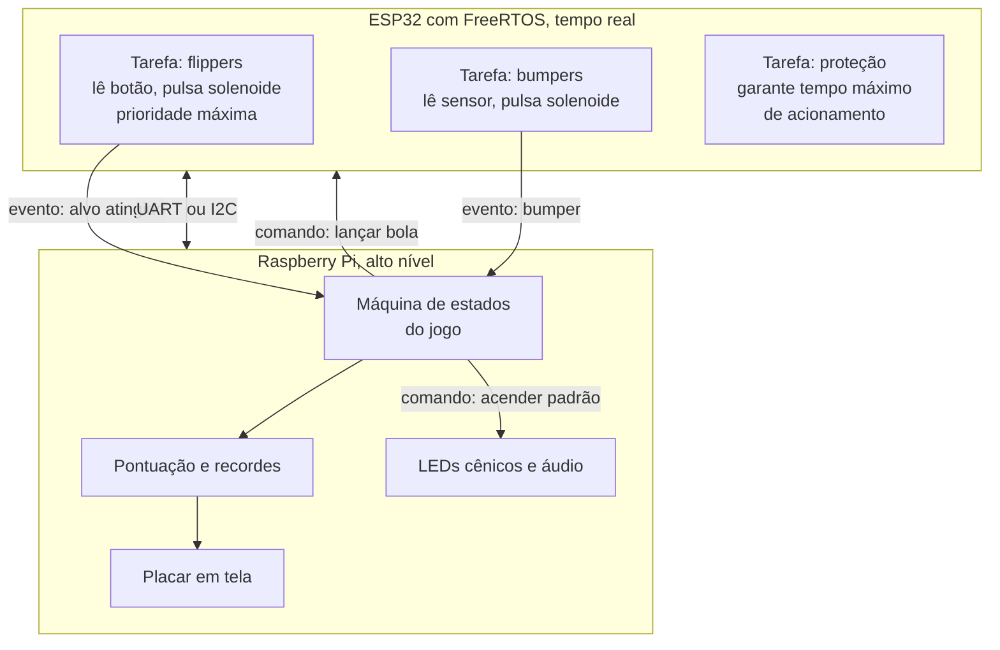

[Voltar ao índice](../README.md)

# 06. Software

## 6.1 Estrutura atual

O código da etapa anterior está em [`upstream/pinball/src`](../upstream/pinball/src) e é enxuto:

```
src/
├── __init__.py
├── main.py                    laço principal, hoje apenas um teste de leitura
├── requeriments.txt           arquivo vazio
└── components/
    ├── __init__.py
    ├── Raspberry.py           classe Raspberry, GPIO e gerência dos expansores
    └── Pcf8574.py             classe Pcf8574, acesso I²C ao expansor
```

O histórico do repositório mostra uma reorganização: existia uma pasta `controllers/` com esboços de
`led.py`, `leds_controller.py`, `l293d_driver.py`, `points_controller.py`, `system_controller.py` e
`network_controller.py`, todos removidos ou vazios. A estrutura convergiu para as duas classes de
acesso ao hardware que sobreviveram. O arquivo `inductive_sensor.py` existe no repositório mas está
vazio.

Vale registrar que o nome `requeriments.txt` está grafado errado, deveria ser `requirements.txt`, e
além disso está vazio. As dependências reais do código são `RPi.GPIO` e `smbus2`.

## 6.2 Classe Pcf8574

Arquivo: [`upstream/pinball/src/components/Pcf8574.py`](../upstream/pinball/src/components/Pcf8574.py)

Encapsula o acesso a um expansor no barramento I²C.

```python
from smbus2 import SMBus

class Pcf8574:
    def __init__(self, barramento=1, endereco=0x20):
        self.barramento = SMBus(barramento)
        self.endereco = endereco
        self.estado = 0b11111111
```

### API

| Método | O que faz |
|---|---|
| `__init__(barramento, endereco)` | Abre o barramento I²C e define o endereço do CI |
| `aciona_saida(pin)` | Zera o bit indicado, acionando a saída |
| `desaciona_saida(pin)` | Coloca o bit indicado em 1, desacionando a saída |
| `get_barramento()` / `set_barramento()` | Acesso ao objeto de barramento |
| `get_endereco()` / `set_endereco()` | Acesso ao endereço configurado |
| `_envia()` | Escreve o byte de estado no CI, uso interno |

### Como funciona o controle de estado

O atributo `self.estado` guarda uma cópia em memória do byte que está nas saídas do CI. Isso é
necessário porque o PCF8574 não permite escrever um pino isoladamente: toda escrita afeta os oito
simultaneamente.

O valor inicial é `0b11111111`, ou seja, todas as saídas em nível alto, que corresponde a todas as
cargas desligadas na lógica adotada.

Acionar uma saída significa zerar o bit correspondente:

```python
self.estado &= ~(1 << pin)   # aciona
self.estado |= (1 << pin)    # desaciona
```

Depois de alterar o bit, `_envia()` transmite o byte completo:

```python
self.barramento.write_byte(self.endereco, self.estado)
```

A lógica está correta. A escolha de acionar com nível baixo é a adequada para o PCF8574, pela
característica quase bidirecional das saídas explicada em
[04. Circuitos integrados](04-circuitos-integrados.md).

### Pontos a melhorar

O método `_envia()` imprime o byte a cada escrita:

```python
literal = f"0b{self.estado:08b}"
print(f"Enviando: {literal}")
```

Isso foi útil na depuração, mas num laço de jogo gera saída em volume alto e custa tempo. Deve virar
uma chamada de `logging` com nível de depuração.

Faltam três coisas para a classe ficar completa. A primeira é um método de leitura, já que o PCF8574
também serve como entrada e a classe hoje só escreve. A segunda é um método para escrever os oito
bits de uma vez, útil para padrões de LED, evitando oito transações onde uma bastaria. A terceira é
tratamento de erro em torno da escrita: se o CI não responder, `write_byte` levanta `OSError`, e no
meio de uma partida isso derruba o programa.

Uma sugestão de complemento:

```python
import logging

log = logging.getLogger(__name__)

class Pcf8574:
    def le_entradas(self) -> int:
        """Lê os oito pinos de uma vez e devolve o byte."""
        return self.barramento.read_byte(self.endereco)

    def escreve_byte(self, valor: int) -> None:
        """Define os oito pinos de uma vez."""
        self.estado = valor & 0xFF
        self._envia()

    def _envia(self) -> None:
        log.debug("PCF 0x%02X <- 0b%08b", self.endereco, self.estado)
        try:
            self.barramento.write_byte(self.endereco, self.estado)
        except OSError as e:
            log.error("Falha ao escrever no PCF 0x%02X: %s", self.endereco, e)
            raise
```

## 6.3 Classe Raspberry

Arquivo: [`upstream/pinball/src/components/Raspberry.py`](../upstream/pinball/src/components/Raspberry.py)

Cuida dos GPIOs e mantém a lista de expansores conectados.

```python
class Raspberry:
    def __init__(self):
        self.pcfs = []
        self.entradas = [
            4, 17, 27, 22, 5, 6, 13, 19,
            26, 23, 24, 25, 12, 16, 20, 21
        ]
        GPIO.setmode(GPIO.BCM)
```

### API

| Método | O que faz |
|---|---|
| `carregar_entradas()` | Configura os 16 GPIOs como entrada com pull-up |
| `ler_entrada(pin)` | Lê um GPIO, validando se ele está na lista de entradas |
| `scan()` | Lê todas as entradas e devolve um dicionário GPIO para estado |
| `adiciona_modulo(endereco)` | Instancia um `Pcf8574` e o guarda na lista |
| `get_pcf(endereco)` | Recupera um expansor já criado pelo endereço |
| `cleanup()` | Libera os GPIOs, chamando `GPIO.cleanup()` |

### Um problema no método scan

O método está assim:

```python
def scan(self) -> dict:
    self.carregar_entradas()
    estados = {p: GPIO.input(p) for p in self.entradas}
    return estados
```

A chamada a `carregar_entradas()` dentro do `scan()` reconfigura os 16 pinos a cada varredura.
Como o `main.py` chama `scan()` dentro de um laço sem pausa, o resultado é que os 16 pinos são
reconfigurados milhares de vezes por segundo. Isso desperdiça CPU e, mais importante, cada
reconfiguração momentaneamente solta o pull-up interno, o que pode gerar leituras falsas.

A configuração pertence à inicialização, não à leitura:

```python
def __init__(self):
    self.pcfs = []
    self.entradas = [...]
    GPIO.setmode(GPIO.BCM)
    self.carregar_entradas()      # uma vez só

def scan(self) -> dict:
    return {p: GPIO.input(p) for p in self.entradas}
```

### Outros pontos

O `adiciona_modulo` fixa o barramento 1 na chamada, `Pcf8574(1, endereco)`, ignorando um possível
parâmetro. Como a Raspberry Pi usa `I2C1` de fato, funciona, mas seria mais limpo tornar isso um
atributo da classe.

O tratamento de erro captura a exceção e devolve `None` com uma mensagem impressa. Quem chama pode
seguir com um `None` sem perceber, e o erro aparece mais tarde em outro lugar. Para inicialização de
hardware é melhor deixar a exceção subir, porque um expansor ausente é uma falha que impede o jogo
de funcionar.

O método `cleanup()` existe mas nunca é chamado no `main.py`. Sem ele, os GPIOs ficam no último
estado após o programa terminar, e a biblioteca emite avisos na execução seguinte.

## 6.4 O main atual

Arquivo: [`upstream/pinball/src/main.py`](../upstream/pinball/src/main.py)

```python
from components.Raspberry import Raspberry
import time

def main():
    rasp = Raspberry()
    pcf = rasp.adiciona_modulo(0x27)

    while True:
        estados = rasp.scan()
        print("Entradas:", estados)

if __name__ == "__main__":
    main()
```

É um teste de leitura, não um jogo. Ele lê as 16 entradas e imprime, indefinidamente.

Três observações. O `import time` não é usado, e o laço não tem pausa alguma, o que faz o processo
consumir 100% de um núcleo e produzir saída ilegível. O `pcf` é criado e nunca usado. E o endereço
`0x27` diverge do esquemático, conforme discutido em [05. Pinagem](05-pinout.md).

Uma versão mínima mais útil para diagnóstico, mostrando apenas mudanças:

```python
import time
from components.Raspberry import Raspberry

def main():
    rasp = Raspberry()
    anterior = rasp.scan()
    print("Estado inicial:", anterior)

    try:
        while True:
            atual = rasp.scan()
            for pino, valor in atual.items():
                if valor != anterior[pino]:
                    estado = "ACIONADO" if valor == 0 else "liberado"
                    print(f"GPIO{pino}: {estado}")
            anterior = atual
            time.sleep(0.005)
    except KeyboardInterrupt:
        pass
    finally:
        rasp.cleanup()

if __name__ == "__main__":
    main()
```

Esse programa serve diretamente para levantar a tabela de mapeamento de sensores pendente em
[05. Pinagem, seção 5.2](05-pinout.md#52-mapeamento-sensor-para-gpio): aciona-se um sensor por vez e
o terminal informa qual GPIO respondeu.

## 6.5 Preparando a Raspberry Pi

O I²C não vem habilitado por padrão. Para ativar:

```bash
sudo raspi-config
# Interface Options, I2C, Yes
sudo reboot
```

Confirmando que o barramento existe e que os CIs respondem:

```bash
sudo apt install -y i2c-tools python3-pip
i2cdetect -y 1
```

A saída mostra os endereços encontrados. Com os três expansores corretamente endereçados, devem
aparecer `20`, `21` e `22`. Com o esquemático como está, aparecerá apenas `20`, e é assim que se
confirma na prática o problema descrito em [P1](09-pendencias-e-roadmap.md).

Instalando as dependências:

```bash
pip3 install RPi.GPIO smbus2
```

Executando:

```bash
cd src
python3 main.py
```

O `main.py` importa como `from components.Raspberry import ...`, então precisa ser executado de
dentro de `src/`, e não da raiz do repositório.

## 6.6 Arquitetura de software recomendada

O relatório da etapa anterior descreve a evolução do raciocínio da equipe. Começaram com um laço
sequencial, perceberam que não dava conta de tratar sensores, solenoides, LEDs e pontuação ao mesmo
tempo, passaram a usar threads, e concluíram que o caminho correto seria um modelo de tarefas ao
estilo RTOS, com a Raspberry Pi cuidando do alto nível e um ESP32 cuidando do tempo real.

Essa conclusão é sólida, e a razão é concreta. O flipper precisa responder ao botão em poucos
milissegundos, de forma consistente. O Linux não garante isso: sob carga, o escalonador pode atrasar
uma thread por dezenas de milissegundos, e o jogador percebe o flipper falhando de forma aleatória.
Além disso, o tempo de acionamento de uma solenoide tem que ser respeitado com precisão, sob risco de
queimar a bobina.

A divisão sugerida é a seguinte.



O ESP32 fica com tudo que tem prazo curto: ler o botão do flipper e pulsar a solenoide, detectar o
bumper e responder, e garantir por conta própria que nenhuma solenoide fique energizada além do
tempo seguro. A Raspberry Pi fica com o que não tem urgência de milissegundos: a máquina de estados
da partida, pontuação, efeitos de luz, som e placar.

A comunicação entre os dois pode ser UART, usando GPIO14 e GPIO15 que estão livres, com um protocolo
simples de mensagens de evento e de comando.

### Se a decisão for manter tudo na Raspberry Pi

É viável para uma primeira versão jogável, com duas ressalvas de implementação.

Para os sensores, usar detecção de evento por interrupção em vez de varredura, o que resolve
latência e repique de uma vez:

```python
GPIO.add_event_detect(pino, GPIO.FALLING,
                      callback=trata_sensor,
                      bouncetime=50)   # ignora repique por 50 ms
```

Para as solenoides, garantir o desligamento com um bloco `finally`, que executa mesmo se algo falhar
no meio:

```python
import time

TEMPO_PULSO = 0.04   # 40 ms

def pulsa_solenoide(pcf, pino):
    pcf.aciona_saida(pino)
    try:
        time.sleep(TEMPO_PULSO)
    finally:
        pcf.desaciona_saida(pino)
```

Ainda assim, esse `time.sleep` pode ser esticado pelo escalonador, e é por isso que a proteção em
hardware descrita em [P2](09-pendencias-e-roadmap.md) continua sendo necessária.

## 6.7 Estrutura de código sugerida

Uma organização que separa acesso ao hardware da lógica do jogo:

```
src/
├── main.py                    ponto de entrada
├── requirements.txt
├── hardware/
│   ├── raspberry.py           GPIO e barramento
│   ├── pcf8574.py             expansor
│   ├── sensor.py              abstrai um sensor, com nome e evento
│   └── solenoide.py           abstrai uma solenoide, com pulso e proteção
├── jogo/
│   ├── estados.py             máquina de estados da partida
│   ├── pontuacao.py           regras de pontuação e recordes
│   └── efeitos.py             padrões de LED e som
└── config/
    └── mapa_io.py             tabela única de mapeamento de pinos
```

A ideia central do `mapa_io.py` é ter um único lugar no código onde o mapeamento físico está
declarado, em vez de números de pino espalhados pela lógica:

```python
# config/mapa_io.py

ENDERECOS_PCF = {
    "solenoides_1": 0x20,
    "solenoides_2": 0x21,
    "leds": 0x22,
}

SENSORES = {
    "flipper_esquerdo": 5,
    "flipper_direito":  6,
    "botao_start":     12,
    "dreno":           17,
    # completar conforme o levantamento da seção 5.2
}

SOLENOIDES = {
    "flipper_esquerdo": ("solenoides_1", 0),
    "flipper_direito":  ("solenoides_1", 1),
    "injetor":          ("solenoides_1", 2),
    # completar
}
```

Com isso, mudar uma ligação física exige editar uma linha, e a lógica do jogo passa a falar em nomes
como `flipper_esquerdo` em vez de `GPIO5`.

---

Anterior: [05. Pinagem e mapa de I/O](05-pinout.md) · Próximo: [07. Mecânica](07-mecanica.md)
