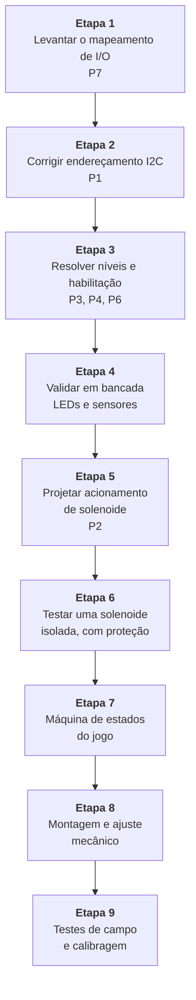

[Voltar ao índice](../README.md)

# 09. Pendências e roadmap

Este documento lista o que está errado, o que está faltando e em que ordem atacar. Os itens vêm de
três fontes: problemas relatados pela equipe anterior no relatório final, divergências encontradas ao
comparar o esquemático com o código, e lacunas de projeto identificadas na revisão.

## 9.1 Resumo por prioridade

| Item | Assunto | Gravidade |
|---|---|---|
| [P1](#p1-conflito-de-endereço-i2c-nos-três-pcf8574) | Os três PCF8574 no mesmo endereço I²C | Crítico |
| [P2](#p2-acionamento-das-solenoides-não-projetado) | Acionamento das solenoides não projetado | Crítico |
| [P3](#p3-pinos-de-habilitação-dos-l293d-sem-origem) | Habilitação dos L293D sem origem definida | Alto |
| [P4](#p4-compatibilidade-de-níveis-entre-33-v-e-5-v) | Compatibilidade de níveis entre 3,3 V e 5 V | Alto |
| [P5](#p5-pull-up-do-barramento-i2c-não-verificado) | Pull-up do I²C não verificado para cabo longo | Médio |
| [P6](#p6-pull-up-fraco-nos-sensores-cf01-a-cf08) | Pull-up interno fraco em CF01 a CF08 | Médio |
| [P7](#p7-mapeamento-de-sensores-não-documentado) | Mapeamento de sensores não documentado | Médio |
| [P8](#p8-licença-declarada-mas-ausente) | Licença declarada mas sem arquivo | Médio |
| [P9](#p9-repique-de-contato-sem-tratamento) | Repique de contato sem tratamento | Médio |
| [P10](#p10-corrente-dos-leds-abaixo-do-previsto) | Corrente dos LEDs abaixo do previsto | Baixo |
| [P11](#p11-arquivos-3d-originais-não-recuperados) | Arquivos 3D originais não recuperados | Médio |
| [P12](#p12-problemas-menores-de-código) | Problemas menores de código | Baixo |

## P1. Conflito de endereço I2C nos três PCF8574

**Gravidade: crítico.**

### O problema

No esquemático, os pinos A0, A1 e A2 dos três PCF8574 estão ligados no mesmo nó, e esse nó vai ao
terra. Como o endereço do PCF8574 é definido justamente por esses três pinos, os três CIs respondem
no endereço `0x20` simultaneamente.

Isso é um conflito de barramento. Quando o mestre escreve em `0x20`, os três expansores recebem o
mesmo byte e acionam suas saídas juntos. Não há como comandar um sem comandar os outros. Numa
leitura, os três tentam responder ao mesmo tempo e o resultado é indefinido.

### Por que isso importa tanto

O relatório da etapa anterior descreve "falhas intermitentes no reconhecimento de sensores",
"dificuldades na comunicação via barramento I²C" e "inconsistências no funcionamento de módulos
externos", que exigiram "reconfiguração de endereços" e "substituição de componentes". Esses sintomas
são exatamente o que um conflito de endereço produz. É bem provável que este seja o problema raiz por
trás de boa parte do tempo perdido em bancada.

### Como confirmar

Na Raspberry Pi, com o hardware montado:

```bash
i2cdetect -y 1
```

Se aparecer apenas `20` com os três expansores ligados, o conflito está confirmado. Se os três
estivessem corretamente endereçados, apareceriam três endereços distintos.

### A correção

Ligar os pinos de seleção de forma diferente em cada CI. Nível baixo é ligar ao terra, nível alto é
ligar ao VDD do CI.

| CI | A2 | A1 | A0 | Endereço | Função |
|---|---|---|---|---|---|
| U1 | GND | GND | GND | `0x20` | Solenoides SL01 a SL08 |
| U2 | GND | GND | VDD | `0x21` | Solenoides SL09 e SL10, comando de driver |
| U3 | GND | VDD | GND | `0x22` | Comando de driver |

Depois de corrigir o esquemático, o código precisa instanciar os três:

```python
rasp = Raspberry()
pcf_sol1 = rasp.adiciona_modulo(0x20)
pcf_sol2 = rasp.adiciona_modulo(0x21)
pcf_leds = rasp.adiciona_modulo(0x22)
```

### Pendência associada no código

O `src/main.py` usa hoje o endereço `0x27`, que corresponde a A0, A1 e A2 todos em nível alto. Não
corresponde nem ao esquemático nem ao firmware da simulação, que usam `0x20`. As três fontes precisam
ficar coerentes.

## P2. Acionamento das solenoides não projetado

**Gravidade: crítico.**

### O problema

As dez solenoides SL01 a SL10 estão ligadas diretamente aos pinos dos PCF8574, e no esquemático
aparecem como símbolos sem modelo atribuído. Não existe estágio de potência entre o expansor e a
carga.

Um pino de PCF8574 drena no máximo 25 mA. Uma solenoide de flipper de pinball puxa vários ampères no
pulso. Ligar uma na outra destrói o expansor imediatamente.

Há também uma divergência entre documentos: o relatório afirma que os L293D serviriam de driver tanto
para os LEDs quanto para as solenoides, mas o esquemático só implementa o caminho dos LEDs.

### Por que o L293D não resolve

Mesmo que as solenoides fossem ligadas aos L293D, não funcionaria. O L293D entrega 600 mA contínuos e
1,2 A de pico por canal, uma ordem de magnitude abaixo do necessário. E a tensão máxima de 36 V
limita as opções de fonte.

### O que precisa ser projetado

**Estágio de potência.** Um MOSFET de canal N por solenoide, com resistência de condução baixa,
comandado pelo pino do PCF8574 através de um resistor de gate. O MOSFET precisa ser dimensionado para
a corrente de pico com folga. Uma alternativa é usar módulos de driver de alta corrente prontos, o
que reduz o trabalho de projeto de placa.

**Diodo de recuperação.** Obrigatório, em antiparalelo com cada bobina. Ao desligar a solenoide, o
colapso do campo magnético gera um pico de tensão invertida que pode chegar a centenas de volts e
destrói o MOSFET. O diodo dá um caminho para essa corrente. Deve ser de recuperação rápida e
suportar a corrente da bobina.

**Fonte dedicada.** Solenoides de pinball tipicamente operam entre 24 V e 48 V. Essa fonte precisa
ser separada da fonte lógica, e os terras precisam ser unidos em um único ponto para evitar que a
corrente de pulso circule pelo terra da lógica.

**Limite de tempo de acionamento.** Este é o ponto mais importante. Uma solenoide de pinball é
projetada para pulsos de 30 ms a 50 ms. Energizada continuamente, a bobina superaquece e queima em
segundos. O software precisa garantir o desligamento, e é fortemente recomendável ter também uma
proteção em hardware que corte o acionamento independentemente do software, porque uma travada do
programa com a solenoide ligada significa dano físico.

**Desacoplamento.** Capacitores de desacoplamento próximos aos drivers, para absorver o transiente de
corrente do pulso e evitar que a queda de tensão momentânea reinicie a lógica.

### Cuidado com a fonte de 24 V ou 48 V perto da lógica

Com uma fonte dessa tensão no mesmo gabinete, um erro de fiação pode levar 24 V a um GPIO de 3,3 V.
Vale separar fisicamente o cabeamento de potência do de sinal, usar conectores diferentes para os dois
domínios, e conferir com multímetro antes de energizar a Raspberry Pi pela primeira vez.

## P3. Pinos de habilitação dos L293D sem origem

**Gravidade: alto.**

No esquemático, os pinos EN1 e EN2 dos três L293D estão ligados a atuadores de estado lógico do
Proteus, que são componentes de simulação usados para alternar um sinal manualmente clicando com o
mouse. Eles não existem no hardware real.

Sem uma origem definida, esses pinos ficam flutuando na montagem física, e o comportamento das saídas
é imprevisível.

Há duas soluções, e a escolha depende do que se quer.

A mais simples é amarrar EN1 e EN2 ao VCC de 5 V através de um resistor, deixando os canais sempre
habilitados e controlando cada LED apenas pela entrada IN correspondente. Resolve o problema com um
resistor.

A mais flexível é ligar EN1 e EN2 a saídas de PCF8574, o que permite apagar pares de canais de uma
vez, útil para efeitos de luz sincronizados e para um desligamento geral rápido. Custa seis pinos de
expansor, e é preciso verificar se há saídas sobrando.

## P4. Compatibilidade de níveis entre 3,3 V e 5 V

**Gravidade: alto.**

Os GPIOs da Raspberry Pi trabalham em 3,3 V e não toleram 5 V. Aplicar 5 V numa entrada danifica o
SoC de forma permanente. No esquemático há dois pontos que merecem verificação.

**Barramento I²C.** Os PCF8574 estão alimentados em 5 V, por BAT1. Num barramento I²C, tanto SDA
quanto SCL são bidirecionais e em dreno aberto, e o nível alto é definido por quem tem o pull-up. Se
houver um pull-up para 5 V em algum ponto do barramento, esses 5 V chegam ao GPIO da Pi.

Há duas saídas. A mais simples é alimentar os PCF8574 em 3,3 V em vez de 5 V, o que é permitido pelo
CI, que aceita de 2,5 V a 6 V. Isso elimina o problema na origem e é a recomendação. A alternativa é
manter os expansores em 5 V e usar um conversor de nível bidirecional, tipo módulo com MOSFETs BSS138,
entre a Pi e o barramento.

Alimentar em 3,3 V tem uma consequência a considerar: as saídas do expansor passam a fornecer nível
alto de 3,3 V, o que ainda é suficiente para as entradas do L293D, cujo limiar de nível alto é de
cerca de 2,3 V.

**Sensores indutivos.** O LJ12A3-4-Z/BX é especificado para alimentação de 6 V a 36 V, tipicamente
12 V ou 24 V. Se a saída do sensor tiver qualquer caminho interno para a alimentação, esses 24 V
chegam ao GPIO.

O esquemático adota a topologia correta, com a rede RN3 puxando para 3,3 V e o sensor apenas
drenando para o terra. Para que funcione, a saída precisa ser genuinamente coletor aberto. Antes de
ligar na Pi, vale medir a tensão na saída do sensor alimentado, com a linha em aberto e com um
pull-up para 3,3 V, confirmando que ela nunca passa de 3,3 V. Se passar, é necessário um divisor
resistivo ou um optoacoplador.

## P5. Pull-up do barramento I2C não verificado

**Gravidade: médio.**

O esquemático não mostra resistores de pull-up externos em SDA e SCL. A Raspberry Pi tem pull-ups
internos de cerca de 1,8 kΩ nesses dois pinos, que costumam bastar para trechos curtos.

Numa mesa de pinball, porém, o cabeamento é longo e passa perto de solenoides. Cabo longo significa
capacitância parasita maior, o que arredonda as bordas do sinal, e proximidade com bobinas significa
ruído injetado. Se aparecerem erros esporádicos de comunicação, este é um dos suspeitos.

O procedimento recomendado é manter o cabeamento do I²C o mais curto possível, usar par trançado ou
cabo blindado com a malha ao terra em um ponto só, roteá-lo afastado do cabeamento de potência das
solenoides, e verificar o formato das bordas de SCL com osciloscópio se houver instabilidade. Se as
bordas estiverem lentas, acrescentar pull-ups externos de 2,2 kΩ a 4,7 kΩ, lembrando que eles ficam
em paralelo com os internos.

## P6. Pull-up fraco nos sensores CF01 a CF08

**Gravidade: médio.**

As chaves CF01 a CF08 não têm rede de pull-up externa no esquemático. Elas dependem do pull-up
interno da Raspberry Pi, que o código habilita corretamente com `GPIO.PUD_UP`.

O pull-up interno é da ordem de 50 kΩ, bem mais fraco que os 10 kΩ da rede RN3 usada nos outros
sensores. Um pull-up fraco em um fio longo é mais suscetível a ruído captado por acoplamento
capacitivo, e o sintoma é acionamento fantasma: o software registra um alvo atingido sem que a bola
tenha passado.

Como CF01 a CF08 são provavelmente os alvos e os botões dos flippers, ou seja, o que mais importa
para a jogabilidade, vale padronizar. A recomendação é acrescentar uma rede resistiva de 10 kΩ para
3,3 V nessas oito linhas, igual à RN3, e opcionalmente um capacitor de 100 nF de cada linha para o
terra, formando um filtro RC que já ajuda no repique tratado em [P9](#p9-repique-de-contato-sem-tratamento).

## P7. Mapeamento de sensores não documentado

**Gravidade: médio.**

O esquemático liga os 13 sensores aos GPIOs por fios que se cruzam sem rótulos de rede, e a imagem
exportada não permite determinar com segurança qual sensor está em qual GPIO. Também não há indicação
de qual sensor cumpre qual papel no jogo.

Sem essa informação, não é possível escrever a lógica do jogo, porque o software não sabe se o GPIO5
é o botão do flipper esquerdo ou um alvo do canto superior.

Existem dois caminhos para resolver, e o ideal é fazer os dois.

O primeiro é abrir o projeto no Proteus e inspecionar cada nó, anotando a correspondência. É o
caminho mais rápido e independe do hardware estar montado.

O segundo é levantar na bancada, com o hardware ligado, usando o programa de diagnóstico proposto em
[06. Software, seção 6.4](06-software.md#64-o-main-atual). Ele imprime qual GPIO mudou de estado, e
basta acionar um sensor por vez e anotar. Esse método tem a vantagem de refletir a fiação real, que
pode divergir do esquemático.

O resultado deve preencher a tabela da
[seção 5.2](05-pinout.md#52-mapeamento-sensor-para-gpio) e ser codificado no `config/mapa_io.py`
sugerido em [06. Software, seção 6.7](06-software.md#67-estrutura-de-código-sugerida).

## P8. Licença declarada mas ausente

**Gravidade: médio.**

O README do repositório anterior afirma que o projeto está licenciado sob a MIT License e remete a um
arquivo `LICENSE`, mas esse arquivo não existe no repositório.

Juridicamente, código publicado sem licença permanece sob direito autoral integral dos autores, o que
significa que ninguém tem permissão explícita para usar, modificar ou redistribuir, apesar do que o
README diz.

Como o trabalho é acadêmico e a intenção declarada é clara, a resolução é simples: pedir aos autores
originais, Daniel Cardoso Fernandes e Roberto da Silva Espindola, que adicionem o arquivo `LICENSE`
com o texto da MIT ao repositório deles. Enquanto isso não acontecer, este repositório não deve
declarar licença própria sobre material de terceiros.

## P9. Repique de contato sem tratamento

**Gravidade: médio.**

Todo contato mecânico apresenta repique: nos primeiros milissegundos após o fechamento, o contato
abre e fecha várias vezes antes de estabilizar. Nas dez chaves KW11-3Z-3 do projeto isso vai
acontecer.

Sem tratamento, um único toque do jogador no botão do flipper é contado como vários acionamentos. A
pontuação fica errada e a solenoide recebe uma sequência de pulsos em vez de um.

A solução em software é direta, usando o parâmetro `bouncetime` da `RPi.GPIO`:

```python
GPIO.add_event_detect(pino, GPIO.FALLING,
                      callback=trata_sensor,
                      bouncetime=50)   # ignora novas transições por 50 ms
```

Vale notar que essa abordagem também resolve o problema do laço de varredura sem pausa apontado em
[06. Software](06-software.md), porque troca varredura por interrupção.

Um cuidado ao escolher o valor: para o botão do flipper, uma janela grande demais impede o jogador de
acionar em sequência rápida. Entre 20 ms e 50 ms é um ponto de partida razoável, a ajustar em teste.

A solução em hardware, complementar, é um filtro RC de 10 kΩ e 100 nF em cada linha, que dá uma
constante de tempo de 1 ms e já suaviza a maior parte do repique antes de chegar ao GPIO.

## P10. Corrente dos LEDs abaixo do previsto

**Gravidade: baixo.**

Os resistores R1 a R12 são de 180 ohms, valor coerente com um cálculo que supõe 5 V na saída do
driver:

```
R = (5 V - 2 V) / 20 mA = 150 Ω, arredondado para 180 Ω
```

O L293D, porém, perde cerca de 1,4 V internamente no transistor superior, então a tensão que chega ao
resistor é de aproximadamente 3,6 V:

```
I = (3,6 V - 2 V) / 180 Ω ≈ 8,9 mA
```

Os LEDs vão acender com menos da metade da corrente pretendida. Continuam visíveis, mas mais fracos do
que o projeto previa, o que numa mesa de pinball com iluminação ambiente pode ficar insuficiente.

Se o brilho não bastar na montagem, trocar para 82 ohms devolve cerca de 19,5 mA. Vale medir a tensão
real na saída do L293D antes de decidir o valor, porque a queda varia com a corrente.

Como observação de projeto, e não como erro: usar um L293D para acender quatro LEDs é desperdício de
recurso. Um ULN2803, com oito canais Darlington no mesmo tamanho de encapsulamento, cobriria os doze
LEDs com dois CIs em vez de três, com queda de tensão menor e custo mais baixo.

## P11. Arquivos 3D originais não recuperados

**Gravidade: médio.**

O relatório descreve em detalhe as peças mecânicas modeladas e impressas e cita os modelos de
referência usados, mas os arquivos que deram origem às peças da etapa anterior não estão no
repositório. Há um novo modelo editável do flipper em `mecanica/modelos-3d/`, porém ele ainda precisa
ser validado no protótipo físico e não substitui os modelos históricos das demais peças.

Se uma peça quebrar, e o relatório registra que peças quebraram durante os testes, será necessário
reprojetá-la do zero. O trabalho de modelagem, que consumiu boa parte do semestre, está preservado
apenas nas máquinas de quem o fez.

A ação é recuperar os arquivos com os autores originais e versioná-los em
`mecanica/modelos-3d/`, junto com um registro dos parâmetros de impressão que funcionaram: material,
altura de camada, preenchimento e orientação de cada peça.

## P12. Problemas menores de código

**Gravidade: baixo.**

Itens de limpeza no código atual, detalhados em [06. Software](06-software.md).

O `scan()` chama `carregar_entradas()` a cada varredura, reconfigurando os 16 GPIOs milhares de vezes
por segundo. A configuração pertence ao construtor.

O laço do `main.py` não tem pausa, consumindo 100% de um núcleo e produzindo saída ilegível.

O `import time` do `main.py` não é usado, e a variável `pcf` é criada e nunca utilizada.

O `_envia()` imprime a cada escrita, o que deve virar `logging` com nível de depuração.

O arquivo `requeriments.txt` está com o nome grafado errado e está vazio. Deveria ser
`requirements.txt` contendo `RPi.GPIO` e `smbus2`.

O `cleanup()` existe mas nunca é chamado, então os GPIOs ficam no último estado ao encerrar.

Falta um método de leitura na classe `Pcf8574`, e um método para escrever os oito bits de uma vez.

O arquivo `src/components/inductive_sensor.py` está vazio no repositório e deve ser implementado ou
removido.

## 9.2 Ordem de trabalho sugerida

A sequência abaixo respeita as dependências entre as tarefas: cada etapa depende do que vem antes.



O raciocínio por trás da ordem é o seguinte.

O mapeamento de I/O vem primeiro porque quase todo o resto depende de saber qual pino é o quê. É
também a tarefa mais barata e pode ser feita sem hardware montado, abrindo o Proteus.

O endereçamento I²C vem em segundo porque nada no lado das saídas funciona de forma controlável
enquanto os três expansores responderem no mesmo endereço.

Níveis e habilitação vêm antes de qualquer teste com hardware energizado, porque errar aqui queima a
Raspberry Pi.

A validação em bancada com LEDs e sensores é o primeiro marco de fato verificável: significa que o
caminho completo, da leitura de um sensor até o acendimento de um LED, está fechado. É um bom ponto de
parada para uma apresentação parcial.

O acionamento das solenoides vem depois, e não antes, porque é a parte que envolve risco de dano e de
projeto novo. Fazer isso com o resto já validado reduz a quantidade de variáveis quando algo der
errado.

Testar uma solenoide isolada antes de montar as dez é o que evita queimar dez bobinas por um erro de
tempo de pulso.

A lógica do jogo vem depois porque depende de todo o hardware responder de forma confiável. Escrever
máquina de estados contra hardware instável gera depuração no lugar errado.

## 9.3 Sobre a migração para ESP32 com RTOS

A conclusão da etapa anterior foi que a arquitetura ideal usa a Raspberry Pi para alto nível e um
ESP32 com RTOS para o tempo real. A recomendação é sólida, com uma ressalva de sequenciamento.

Não vale começar por ela. Migrar para uma arquitetura de dois processadores acrescenta um protocolo de
comunicação, uma segunda toolchain e uma nova classe de bugs de sincronização, tudo isso antes de
existir um pinball que funcione.

O caminho mais seguro é fechar primeiro uma versão jogável só com a Raspberry Pi, tratando os
sensores por interrupção e as solenoides com pulso protegido. Isso valida o hardware, a mecânica e as
regras do jogo com uma variável de menos.

Se, com isso funcionando, a resposta dos flippers se mostrar inconsistente na prática, aí a migração
do laço de tempo real para o ESP32 se justifica, e passa a ser uma otimização com problema conhecido
em vez de uma aposta arquitetural. O caminho de comunicação já está livre: GPIO14 e GPIO15, a UART,
não são usados por nada no projeto atual.

---

Anterior: [08. Simulação no Proteus](08-simulacao-proteus.md)
