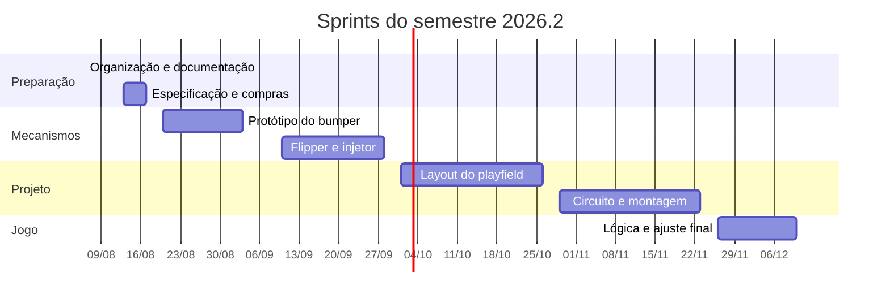

[Voltar ao índice](../README.md)

# 10. Plano do semestre 2026.2

Plano de trabalho para a continuidade do projeto, organizado sobre o calendário real de aulas. A
sequência técnica segue a ordem de dependências estabelecida em
[09. Pendências e roadmap](09-pendencias-e-roadmap.md).

## 10.1 Calendário de encontros

O semestre vai de 06/08 a 11/12, com aulas toda quinta-feira e uma segunda-feira a cada quinze dias.
A cadência das segundas começa em 17/08 e segue de quinze em quinze dias. São 28 encontros previstos,
dos quais apenas um cai em feriado, restando **27 encontros úteis**. O último é a quinta de 10/12.

O encontro de 06/08 foi usado para organizar o projeto, produzir a documentação técnica e montar o
quadro de atividades, então o levantamento técnico começa em 13/08.

| # | Data | Dia | Observação |
|---|---|---|---|
| 1 | 06/08 | Quinta | Concluído: documentação técnica e quadro de atividades |
| 2 | 13/08 | Quinta |  |
| 3 | 17/08 | Segunda |  |
| 4 | 20/08 | Quinta |  |
| 5 | 27/08 | Quinta |  |
| 6 | 31/08 | Segunda |  |
| 7 | 03/09 | Quinta |  |
| 8 | 10/09 | Quinta |  |
| 9 | 14/09 | Segunda |  |
| 10 | 17/09 | Quinta |  |
| 11 | 24/09 | Quinta |  |
| 12 | 28/09 | Segunda |  |
| 13 | 01/10 | Quinta |  |
| 14 | 08/10 | Quinta |  |
| - | 12/10 | Segunda | Feriado, N. Sra. Aparecida |
| 15 | 15/10 | Quinta |  |
| 16 | 22/10 | Quinta |  |
| 17 | 26/10 | Segunda |  |
| 18 | 29/10 | Quinta |  |
| 19 | 05/11 | Quinta |  |
| 20 | 09/11 | Segunda |  |
| 21 | 12/11 | Quinta |  |
| 22 | 19/11 | Quinta |  |
| 23 | 23/11 | Segunda |  |
| 24 | 26/11 | Quinta |  |
| 25 | 03/12 | Quinta |  |
| 26 | 07/12 | Segunda |  |
| 27 | 10/12 | Quinta | Último encontro do semestre |

Confira as datas contra o calendário acadêmico oficial do IFSC, principalmente semanas de avaliação e
recessos, que podem reduzir esse total.

## 10.2 Como usar os dois tipos de encontro

A diferença de cadência entre quinta e segunda é uma vantagem que vale explorar de propósito, em vez
de tratar todo encontro igual.

**Quintas, semanais.** Trabalho de execução. São os encontros de bancada: medir, montar, testar,
programar, corrigir. Como acontecem toda semana, o custo de um teste que dá errado é baixo, dá para
tentar de novo em sete dias.

**Segundas, quinzenais.** A primeira é 17/08, e depois seguem de quinze em quinze dias: 31/08, 14/09,
28/09, 12/10 (feriado), 26/10, 09/11, 23/11 e 07/12. Trabalho de fechamento e decisão. São os encontros para revisar o que
avançou nas duas quintas anteriores, decidir o que muda no plano, atualizar a documentação e
apresentar resultado ao professor. Como são raras, não devem ser gastas em tarefa de bancada que
poderia rodar numa quinta.

Uma regra prática que ajuda: nada entra no repositório sem ter passado por uma segunda. É nelas que a
documentação é atualizada, e é o que evita chegar em dezembro com o mesmo problema de documentação
que motivou este trabalho.

## 10.3 Sprints

> **Revisado em 13/08.** A ordem passou a ser de baixo para cima. Em vez de desenhar o playfield e o
> circuito no papel para depois montar, o semestre começa fazendo o mecanismo mais crítico funcionar
> de verdade: acionar uma solenoide e arremessar a bola com força adequada. O desenho vem depois,
> informado pelo que o protótipo ensinar.

Seis blocos, cada um com um resultado verificável ao final. A ideia de ter sempre algo demonstrável é
proteger contra o risco que mais afetou a etapa anterior: chegar ao fim do prazo com muitas frentes
em 80%.

**Por que começar pelos mecanismos.** A força necessária para arremessar a bola, a corrente que a
solenoide puxa e o tempo de pulso adequado só se descobrem experimentando. Esses três números são
exatamente os que o circuito precisa para ser dimensionado, e as dimensões do mecanismo montado são o
que o layout do playfield precisa para posicionar os elementos. Fazendo nessa ordem, cada etapa
seguinte parte de dado medido em vez de estimativa.

### Sprint 0. Organização e preparação, encontros 1 a 3 (06/08 a 17/08)

**Objetivo:** ter em mãos o que é preciso para montar o primeiro bumper.

- [x] Organizar o projeto, produzir a documentação técnica e montar o quadro de atividades (06/08)
- [x] Decidir redesenhar o circuito em vez de corrigir o anterior (13/08)
- Medir a bola e a área interna útil do playfield
- Especificar a solenoide do bumper: tensão, corrente e curso
- Fechar a compra do material do protótipo: solenoide, fonte, MOSFET, diodo de recuperação
- Inventariar o hardware físico e as peças 3D já impressas
- Contatar a turma anterior para recuperar os arquivos 3D ([P11](09-pendencias-e-roadmap.md))

**Entrega:** material do protótipo comprado ou encomendado, e inventário do que já existe.

**Marco de segunda (17/08):** fechar a especificação e a compra. Compra em trânsito é o que mais
atrasa projeto de bancada, então quanto antes sair, melhor.

### Sprint 1. Protótipo do bumper, encontros 4 a 7 (20/08 a 03/09)

**Objetivo:** uma solenoide arremessando a bola com força que faça sentido para a mesa.

- Montar o acionamento de uma solenoide: MOSFET, diodo de recuperação e fonte dedicada
- Implementar a proteção de tempo de pulso, em software e em hardware
  ([P2](09-pendencias-e-roadmap.md))
- Acionar pela Raspberry Pi e medir o tempo de pulso real
- Calibrar a força com a mesa na inclinação de trabalho e a bola de verdade
- Medir a corrente de pico e o aquecimento da bobina
- Registrar os números medidos, que alimentam o projeto do circuito

**Entrega:** bumper acionando e arremessando a bola de forma repetível, com os números medidos
anotados.

**Marco de segunda (31/08):** demonstrar o bumper funcionando. É o primeiro resultado físico do
semestre e um bom momento para mostrar ao professor.

> **Cuidado principal deste sprint.** Solenoide de pinball é feita para pulsos de 30 a 50 ms.
> Energizada continuamente, a bobina queima em segundos. A proteção de tempo precisa existir desde o
> primeiro acionamento, não depois. E teste sempre uma unidade isolada antes de replicar.

### Sprint 2. Os demais mecanismos, encontros 8 a 12 (10/09 a 28/09)

**Objetivo:** ter os três tipos de mecanismo do jogo funcionando.

- Replicar o acionamento para o segundo bumper
- Prototipar o flipper: mesmo princípio, geometria e curso diferentes
- Prototipar o injetor de bolas
- Medir as dimensões finais de cada mecanismo montado, com suporte e curso
- Ajustar ou reimprimir as peças 3D que não servirem

**Entrega:** bumper, flipper e injetor funcionando em bancada, com dimensões medidas.

**Marcos de segunda (14/09 e 28/09):** na primeira, revisar o andamento do flipper. Na segunda,
demonstrar os três mecanismos.

### Sprint 3. Layout do playfield, encontros 13 a 17 (01/10 a 26/10)

**Objetivo:** decidir onde cada mecanismo vai e como o jogo funciona.

- Rolar a bola na mesa inclinada e mapear as trajetórias naturais
- Posicionar os mecanismos, aproveitando os furos que já existem
- Definir alvos, sensores e o dreno
- Escrever as regras de pontuação
- Fechar a contagem de I/O ([seção 12.5](12-projeto-novo-do-circuito.md#125-passo-1-contagem-de-io))

**Entrega:** layout definido e contagem de entradas e saídas fechada.

**Marco de segunda (26/10):** apresentar o layout e a contagem.

### Sprint 4. Circuito e montagem, encontros 18 a 23 (29/10 a 23/11)

**Objetivo:** sair do protótipo de bancada para a instalação na mesa.

- Definir a arquitetura de I/O e a topologia de iluminação
- Desenhar o esquemático, com rótulo de rede em todos os fios
  ([seção 12.8](12-projeto-novo-do-circuito.md#128-regras-para-o-esquemático-novo))
- Fechar a lista de materiais e comprar
- Instalar sensores, atuadores e luzes na mesa
- Passar o cabeamento separando potência de sinal ([P5](09-pendencias-e-roadmap.md))
- Validar cada caminho: sensor lido, luz acesa, solenoide acionada

**Entrega:** hardware instalado na mesa e respondendo a comando.

**Marcos de segunda (09/11 e 23/11):** na primeira, revisar o esquemático antes de comprar. Na
segunda, demonstrar o hardware instalado.

### Sprint 5. Lógica do jogo e ajuste, encontros 24 a 27 (26/11 a 10/12)

**Objetivo:** transformar hardware que responde em um jogo que se joga.

- Centralizar o mapeamento de pinos em um arquivo de configuração
- Implementar a máquina de estados: atração, partida, bola em jogo, fim de jogo
- Implementar pontuação e contagem de bolas
- Calibrar força dos flippers e posição dos sensores
- Testar com jogadores de fora da equipe
- Fechar a documentação e o relatório final

**Entrega:** pinball jogável, documentação atualizada e relatório entregue.

**Marco de segunda (07/12):** última segunda do semestre. O que não estiver encaminhado aqui não
entra.

> **Atenção ao aperto deste sprint.** Restam quatro encontros para a lógica do jogo, a calibragem e o
> relatório. A mitigação é escrever a lógica em paralelo ao Sprint 4, assim que os primeiros sensores
> responderem, em vez de esperar tudo instalado. E o relatório precisa ser escrito de forma
> incremental ao longo do semestre.

## 10.4 Visão do semestre

## 10.5 Riscos e como reduzi-los

Os riscos abaixo saem do que de fato aconteceu na etapa anterior, registrado no relatório final. Não
são hipóteses.

**Prazo curto para escopo multidisciplinar.** Foi o problema principal relatado, e aqui há 27
encontros úteis com o semestre fechando em 11/12, sendo que o primeiro já foi consumido pela
organização. A mitigação é ter um resultado demonstrável ao fim de cada sprint, em vez de várias
frentes incompletas. Se algo tiver que ser cortado, é melhor cortar cedo e conscientemente, e a
segunda de 07/12 é o último momento razoável para essa decisão.

**Retrabalho mecânico.** Peças precisaram ser refeitas por incompatibilidade dimensional, e outras
quebraram em teste. A mitigação é começar a reimpressão cedo, no Sprint 0, em paralelo com o trabalho
eletrônico, e usar PETG nas peças que sofrem impacto.

**Queimar componentes.** A combinação de 3,3 V com 5 V e, mais adiante, com 24 V de solenoide, é onde
o dano acontece. A mitigação é a ordem de trabalho proposta: resolver níveis antes de energizar, e
testar uma solenoide antes de dez.

**Bugs de hardware confundidos com bugs de software.** Foi o que consumiu tempo na etapa anterior,
quando o conflito de endereço I²C apareceu como falha intermitente de sensor. A mitigação é validar o
hardware camada por camada, confirmando cada nível antes de subir, e desconfiar de sintoma
intermitente.

**Equipe pequena.** Duas pessoas para eletrônica, software e mecânica. A mitigação é dividir por
frente com dono definido, e usar as segundas quinzenais para sincronizar em vez de trabalhar em
paralelo cego.

## 10.6 Rotina sugerida

Uma prática que resolve o problema que originou este trabalho: ao final de cada encontro, registrar em
duas ou três linhas o que foi feito, o que ficou pendente e qual a próxima ação. Cinco minutos por
encontro.

A documentação ruim da etapa anterior não veio de má vontade, veio de deixar o registro para o fim,
quando o contexto já tinha se perdido. Vinte e sete encontros com registro curto valem mais que uma semana
de escrita em dezembro.

---

Anterior: [09. Pendências e roadmap](09-pendencias-e-roadmap.md) ·
Próximo: [11. Ficha de levantamento](11-ficha-de-levantamento.md)
