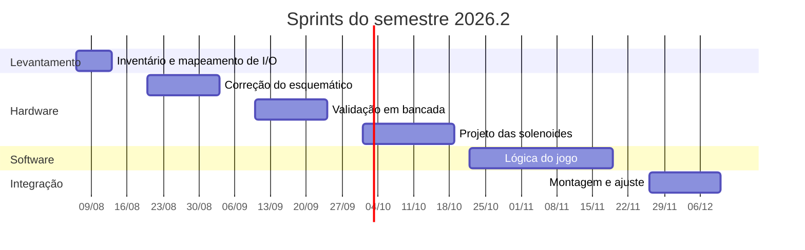

[Voltar ao índice](../README.md)

# 10. Plano do semestre 2026.2

Plano de trabalho para a continuidade do projeto, organizado sobre o calendário real de aulas. A
sequência técnica segue a ordem de dependências estabelecida em
[09. Pendências e roadmap](09-pendencias-e-roadmap.md).

## 10.1 Calendário de encontros

O semestre vai de 06/08 a 11/12, com aulas toda quinta-feira e uma segunda-feira a cada quinze dias.
São 28 encontros previstos. Dois caem em feriado e a segunda de 10/08 foi cancelada, restando
**25 encontros úteis**. O último é a quinta de 10/12.

| # | Data | Dia | Observação |
|---|---|---|---|
| 1 | 06/08 | Quinta |  |
| - | 10/08 | Segunda | Sem aula nesta segunda |
| 2 | 13/08 | Quinta |  |
| 3 | 20/08 | Quinta |  |
| 4 | 24/08 | Segunda |  |
| 5 | 27/08 | Quinta |  |
| 6 | 03/09 | Quinta |  |
| - | 07/09 | Segunda | Feriado, Independência |
| 7 | 10/09 | Quinta |  |
| 8 | 17/09 | Quinta |  |
| 9 | 21/09 | Segunda |  |
| 10 | 24/09 | Quinta |  |
| 11 | 01/10 | Quinta |  |
| 12 | 05/10 | Segunda |  |
| 13 | 08/10 | Quinta |  |
| 14 | 15/10 | Quinta |  |
| 15 | 19/10 | Segunda |  |
| 16 | 22/10 | Quinta |  |
| 17 | 29/10 | Quinta |  |
| - | 02/11 | Segunda | Feriado, Finados |
| 18 | 05/11 | Quinta |  |
| 19 | 12/11 | Quinta |  |
| 20 | 16/11 | Segunda |  |
| 21 | 19/11 | Quinta |  |
| 22 | 26/11 | Quinta |  |
| 23 | 30/11 | Segunda |  |
| 24 | 03/12 | Quinta |  |
| 25 | 10/12 | Quinta | Último encontro do semestre |

Confira as datas contra o calendário acadêmico oficial do IFSC, principalmente semanas de avaliação e
recessos, que podem reduzir esse total.

## 10.2 Como usar os dois tipos de encontro

A diferença de cadência entre quinta e segunda é uma vantagem que vale explorar de propósito, em vez
de tratar todo encontro igual.

**Quintas, semanais.** Trabalho de execução. São os encontros de bancada: medir, montar, testar,
programar, corrigir. Como acontecem toda semana, o custo de um teste que dá errado é baixo, dá para
tentar de novo em sete dias.

**Segundas, quinzenais.** Trabalho de fechamento e decisão. São os encontros para revisar o que
avançou nas duas quintas anteriores, decidir o que muda no plano, atualizar a documentação e
apresentar resultado ao professor. Como são raras, não devem ser gastas em tarefa de bancada que
poderia rodar numa quinta.

Uma regra prática que ajuda: nada entra no repositório sem ter passado por uma segunda. É nelas que a
documentação é atualizada, e é o que evita chegar em dezembro com o mesmo problema de documentação
que motivou este trabalho.

## 10.3 Sprints

O semestre se divide em seis blocos, cada um com um resultado verificável ao final. A ideia de ter
sempre um resultado demonstrável é proteger contra o risco que mais afetou a etapa anterior: chegar
ao fim do prazo com muitas frentes em 80%.

### Sprint 0. Levantamento, encontros 1 e 2 (06/08 a 13/08)

**Objetivo:** saber exatamente o que existe e em que estado.

- Clonar o repositório e ler a documentação técnica completa
- Abrir o projeto no Proteus e rodar a simulação existente
- Inventariar o hardware físico: quais componentes existem, quais foram queimados, o que falta comprar
- Inventariar as peças mecânicas impressas e identificar as que estão quebradas ou faltando
- Contatar a equipe anterior para recuperar os arquivos 3D ([P11](09-pendencias-e-roadmap.md))
- Levantar o mapeamento sensor para GPIO no Proteus ([P7](09-pendencias-e-roadmap.md))

**Entrega:** tabela da [seção 5.2](05-pinout.md#52-mapeamento-sensor-para-gpio) preenchida e lista de
compras fechada.

**Por que isso primeiro:** quase tudo depende de saber qual pino é o quê, e essa tarefa não precisa de
hardware montado nem de material comprado. É o melhor uso possível das primeiras semanas, enquanto
qualquer compra ainda estaria em trânsito.

**Sprint curto.** Com o cancelamento da segunda de 10/08, restam apenas dois encontros aqui, 06/08 e
13/08. Leitura da documentação e contato com a turma anterior não dependem de estar em sala, então
vale resolvê-los fora do horário de aula e reservar o encontro de 13/08 para o levantamento no
Proteus e o fechamento da lista de compras.

### Sprint 1. Correção do hardware, encontros 3 a 6 (20/08 a 03/09)

**Objetivo:** deixar o projeto eletrônico correto no papel antes de energizar nada.

- Corrigir o endereçamento dos três PCF8574 no esquemático ([P1](09-pendencias-e-roadmap.md))
- Definir a origem dos pinos de habilitação dos L293D ([P3](09-pendencias-e-roadmap.md))
- Decidir a alimentação dos expansores, 3,3 V ou conversor de nível ([P4](09-pendencias-e-roadmap.md))
- Acrescentar rede de pull-up para CF01 a CF08 ([P6](09-pendencias-e-roadmap.md))
- Medir a saída dos sensores indutivos e confirmar que não passa de 3,3 V
- Atualizar o esquemático no Proteus e simular novamente

**Entrega:** esquemático revisado, com as correções documentadas, e simulação rodando com três
expansores em endereços distintos.

**Marco de segunda (24/08):** apresentar ao professor o diagnóstico dos problemas encontrados e as
correções propostas. Esse é um bom momento para validar as decisões antes de comprar componente.

### Sprint 2. Bancada, encontros 7 a 10 (10/09 a 24/09)

**Objetivo:** fechar o caminho completo de sensor até LED, com hardware real.

- Montar o circuito em protoboard ou placa de ensaio
- Confirmar os três expansores com `i2cdetect -y 1`
- Validar leitura de todos os 13 sensores com o programa de diagnóstico
- Validar acionamento dos 12 LEDs
- Ajustar o valor dos resistores de LED se o brilho ficar insuficiente
  ([P10](09-pendencias-e-roadmap.md))
- Implementar detecção por interrupção com tratamento de repique
  ([P9](09-pendencias-e-roadmap.md))
- Aplicar as correções de código listadas em [P12](09-pendencias-e-roadmap.md)

**Entrega:** demonstração em que acionar um sensor acende um LED, com resposta consistente. Primeiro
marco de fato verificável do semestre.

**Marco de segunda (21/09):** demonstrar o caminho fechado e atualizar a documentação com o que
divergiu do previsto.

### Sprint 3. Solenoides, encontros 11 a 15 (01/10 a 19/10)

**Objetivo:** resolver a parte que a etapa anterior não chegou a projetar.

- Especificar as solenoides: tensão, corrente de pico e tempo máximo de pulso
- Projetar o estágio de potência com MOSFET, diodo de recuperação e desacoplamento
  ([P2](09-pendencias-e-roadmap.md))
- Dimensionar e adquirir a fonte dedicada
- Montar e testar **uma única** solenoide, com proteção de tempo em software e em hardware
- Medir o tempo de pulso real e o comportamento térmico da bobina
- Só depois de validado, replicar para as demais

**Entrega:** uma solenoide acionada de forma confiável, com proteção comprovada, e o circuito
documentado.

**Marco de segunda (05/10):** revisar o projeto do estágio de potência com o professor antes de
energizar. Esta é a etapa com risco real de dano, e vale uma revisão externa.

**Cuidado principal:** testar sempre uma solenoide isolada primeiro. Um erro de tempo de pulso
replicado em dez bobinas queima dez bobinas.

### Sprint 4. Lógica do jogo, encontros 16 a 21 (22/10 a 19/11)

**Objetivo:** transformar hardware que responde em um jogo que se joga.

- Reorganizar o código na estrutura proposta em
  [06. Software, seção 6.7](06-software.md#67-estrutura-de-código-sugerida)
- Centralizar o mapeamento físico em `config/mapa_io.py`
- Implementar a máquina de estados: atração, partida, bola em jogo, fim de jogo
- Implementar pontuação e contagem de bolas
- Implementar os efeitos de LED por estado
- Implementar o acionamento dos flippers respondendo aos botões
- Medir a latência real entre botão e movimento do flipper

**Entrega:** partida completa jogável, mesmo que sobre a bancada e sem a mesa montada.

**Marco de segunda (16/11):** demonstrar a partida completa. É a penúltima segunda do semestre, então
serve também para decidir o que ainda cabe no Sprint 5.

**Ponto de decisão:** com a latência do flipper medida, decidir se a migração para ESP32 se justifica.
Se a resposta estiver consistente, não migre. Ver
[9.3](09-pendencias-e-roadmap.md#93-sobre-a-migração-para-esp32-com-rtos).

### Sprint 5. Montagem e ajuste, encontros 22 a 25 (26/11 a 10/12)

**Objetivo:** integrar tudo na mesa física e ajustar a jogabilidade.

- Reimprimir peças quebradas ou faltantes
- Montar a estrutura e instalar sensores e atuadores na mesa
- Definir e medir a inclinação da mesa
- Passar o cabeamento separando potência de sinal
- Calibrar posição dos sensores e força dos flippers
- Testar com jogadores de fora da equipe
- Fechar a documentação e o relatório final

**Entrega:** pinball montado e jogável, documentação atualizada e relatório entregue.

**Marco de segunda (30/11):** revisão do estado da montagem e corte de escopo. É a última segunda do
semestre, então o que não estiver encaminhado aqui provavelmente não entra.

**Atenção ao aperto deste sprint.** Com o fim em 11/12, restam apenas quatro encontros para montagem,
calibragem, teste com jogadores e relatório. Não há folga para retrabalho mecânico. Duas medidas
reduzem o risco: adiantar a reimpressão das peças para o Sprint 0, em paralelo com o trabalho
eletrônico, e escrever o relatório de forma incremental ao longo do semestre em vez de deixá-lo para
o final. O encontro de 10/12 deve ser reservado para a entrega e a apresentação, não para
desenvolvimento.

## 10.4 Visão do semestre

## 10.5 Riscos e como reduzi-los

Os riscos abaixo saem do que de fato aconteceu na etapa anterior, registrado no relatório final. Não
são hipóteses.

**Prazo curto para escopo multidisciplinar.** Foi o problema principal relatado, e aqui ele é ainda
mais apertado: 25 encontros contra os 28 inicialmente previstos, com o semestre fechando em 11/12. A
mitigação é ter um resultado demonstrável ao fim de cada sprint, em vez de várias frentes
incompletas. Se algo tiver que ser cortado, é melhor cortar cedo e conscientemente, e a segunda de
30/11 é o último momento razoável para essa decisão.

**Retrabalho mecânico.** Peças precisaram ser refeitas por incompatibilidade dimensional, e outras
quebraram em teste. A mitigação é começar a reimpressão cedo, no Sprint 0, em paralelo com o trabalho
eletrônico, e usar PETG nas peças que sofrem impacto.

**Queimar componentes.** A combinação de 3,3 V com 5 V e, mais adiante, com 24 V de solenoide, é onde
o dano acontece. A mitigação é a ordem de trabalho proposta: resolver níveis antes de energizar, e
testar uma solenoide antes de dez.

**Bugs de hardware confundidos com bugs de software.** Foi o que consumiu tempo na etapa anterior,
quando o conflito de endereço I²C apareceu como falha intermitente de sensor. A mitigação é validar o
hardware camada por camada, confirmando cada nível antes de subir, e desconfiar de sintoma
intermitente.

**Equipe pequena.** Duas pessoas para eletrônica, software e mecânica. A mitigação é dividir por
frente com dono definido, e usar as segundas quinzenais para sincronizar em vez de trabalhar em
paralelo cego.

## 10.6 Rotina sugerida

Uma prática que resolve o problema que originou este trabalho: ao final de cada encontro, registrar em
duas ou três linhas o que foi feito, o que ficou pendente e qual a próxima ação. Cinco minutos por
encontro.

A documentação ruim da etapa anterior não veio de má vontade, veio de deixar o registro para o fim,
quando o contexto já tinha se perdido. Vinte e cinco encontros com registro curto valem mais que uma semana
de escrita em dezembro.

---

Anterior: [09. Pendências e roadmap](09-pendencias-e-roadmap.md)
