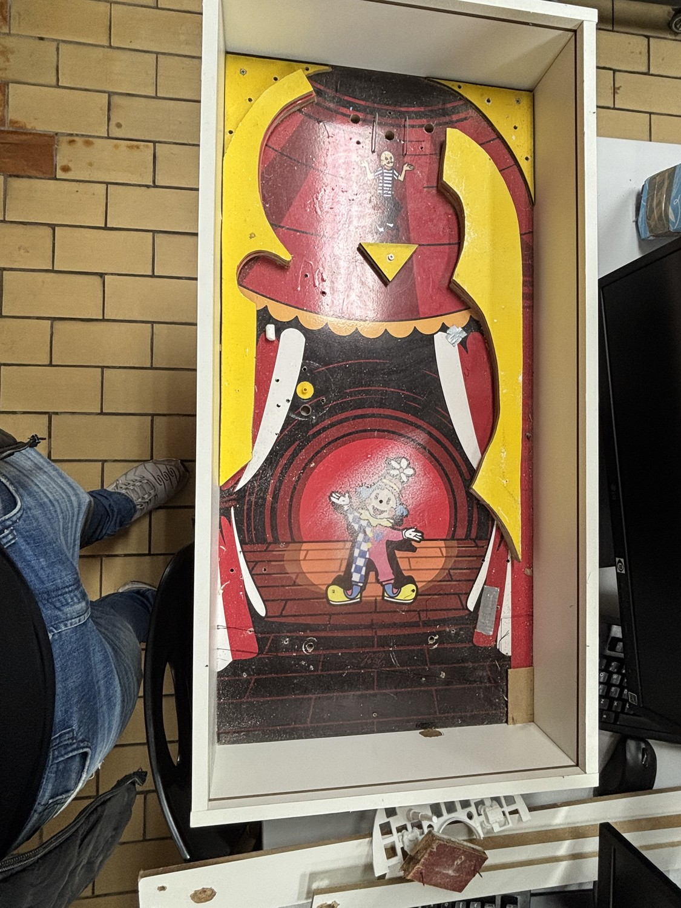
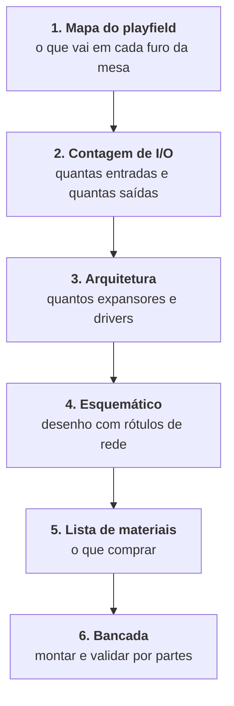

[Voltar ao índice](../README.md)

# 12. Projeto novo do circuito

Registro da decisão tomada em 13/08 de projetar o circuito do zero, em vez de corrigir o esquemático
da etapa anterior, e do caminho para fazer isso.

## 12.1 O que motivou a decisão

A foto do estado atual da mesa, tirada em 13/08, mostra o seguinte.

O gabinete está pronto e o playfield está decorado, com a arte montada em camadas de MDF recortadas.
Estão instaladas as guias de bola brancas, um poste amarelo e alguns reforços. Os furos de montagem
já existem: três furos maiores no arco superior, dois furos com anel na região dos flippers e uma
quantidade de furos de parafuso ao longo das bordas.

O ponto decisivo é o que **não** está lá. Não há um único sensor, solenoide, LED, fio, conector ou
placa instalada. A eletrônica do projeto nunca saiu do papel.

Isso muda a natureza do trabalho. Enquanto se supunha que existia uma montagem elétrica, fazia
sentido levantar o esquemático antigo para não perder a fiação já feita. Sem fiação alguma, esse
esforço deixa de ter retorno.

## 12.2 Por que redesenhar é a escolha certa aqui

**Não há nada a preservar.** O único custo de abandonar o esquemático antigo é o tempo que a turma
anterior gastou nele, e esse custo já foi pago. Manter um projeto ruim para honrar esforço passado é
o erro clássico de custo afundado.

**Corrigir daria quase o mesmo trabalho.** As pendências abertas no esquemático são estruturais, não
cosméticas: os três expansores no mesmo endereço I2C ([P1](09-pendencias-e-roadmap.md)), o
acionamento das solenoides que não existe ([P2](09-pendencias-e-roadmap.md)), os pinos de habilitação
sem origem definida ([P3](09-pendencias-e-roadmap.md)) e a incompatibilidade de níveis entre 3,3 V e
5 V ([P4](09-pendencias-e-roadmap.md)). Resolver os quatro significa redesenhar boa parte do
circuito, só que carregando decisões que ninguém do grupo atual tomou.

**O gargalo desaparece.** A pendência que travava o cronograma era o mapeamento sensor para GPIO
([P7](09-pendencias-e-roadmap.md)), impossível de ler no esquemático porque os fios se cruzam sem
rótulo de rede. Sem fiação física, esse mapeamento deixa de ser algo a descobrir e passa a ser algo a
decidir. É uma inversão que economiza dois encontros.

**Domínio sobre o projeto.** Num projeto integrador, saber justificar cada escolha do circuito vale
mais do que herdar um desenho pronto. O grupo passa a poder defender cada decisão na apresentação
final.

## 12.3 O que continua valendo do trabalho anterior

Redesenhar o circuito não é recomeçar do zero. Aproveita-se:

- A **documentação técnica** deste repositório, que descreve o PCF8574 e o L293D em detalhe, com
  pinagem, protocolo, limites de corrente e cálculos. Ver
  [04. Circuitos integrados](04-circuitos-integrados.md).
- A **arquitetura conceitual**, que continua correta: sensores diretos no GPIO para manter a
  latência baixa, expansores I2C para multiplicar as saídas, drivers para a potência. Ver
  [02. Arquitetura de hardware](02-arquitetura-hardware.md).
- A **lista de pendências**, que vira lista de erros a não repetir. Cada item de
  [09. Pendências](09-pendencias-e-roadmap.md) é uma armadilha já mapeada.
- Os **componentes físicos** que a turma anterior comprou, se estiverem em bom estado.
- A **mecânica**, que é o que de fato está construído.

O esquemático antigo permanece no submódulo `upstream/pinball` como referência histórica, e a
documentação dele continua útil justamente para saber o que não fazer.

## 12.4 A ordem correta de trabalho

Aqui há uma inversão importante em relação ao instinto natural, que é abrir a ferramenta de
esquemático e começar a desenhar.

O circuito é consequência do playfield, não o contrário. Quantos sensores existem, quantas solenoides
e quantas luzes é uma decisão de jogo, tomada olhando a mesa. Só depois disso é que se sabe quantos
pinos de I/O são necessários, e só então faz sentido escolher quantos expansores e quantos drivers
usar. Desenhar o circuito antes disso é desenhar no vazio.

A vantagem prática dessa ordem é que a lista de materiais, que é o que motivou a decisão, sai como
resultado natural do passo 5, e não de um chute.

## 12.5 Passo 1: mapa do playfield

Este é o trabalho a fazer com a mesa na frente. Os furos já existentes são a melhor pista do que a
turma anterior pretendia, e vale aproveitá-los em vez de furar de novo.

Numere cada furo e preencha:

| Nº | Posição na mesa | Diâmetro | O que vai ali | Tipo de I/O |
|---|---|---|---|---|
| 1 | | | | |
| 2 | | | | |
| 3 | | | | |
| 4 | | | | |
| 5 | | | | |

Em "Tipo de I/O", use uma das opções: entrada de sensor, saída de solenoide, saída de luz, ou nenhum,
para furo puramente mecânico.

O que se sabe da foto e que serve de ponto de partida:

| Região | O que se vê | Hipótese |
|---|---|---|
| Arco superior | Três furos de cerca de 10 mm, alinhados | Luzes, ou alvos com sensor |
| Região do palhaço | Um furo de cerca de 10 mm à esquerda, um poste amarelo | Bumper ou alvo |
| Base | Dois furos com anel, simétricos | Eixos dos flippers |
| Bordas amarelas | Muitos furos de cerca de 3 mm | Fixação de guias e postes |
| Lateral direita | Rampa lateral | Entrada da bola, injetor |

Confirme cada hipótese medindo, e principalmente pergunte à turma anterior, que é a única fonte
sobre a intenção original. Isso já está no quadro de atividades.

Uma decisão de escopo que vale tomar aqui: **quantos elementos ativos a mesa realmente precisa**. O
projeto anterior previa dez solenoides e doze LEDs, e não chegou a montar nenhum. Uma mesa jogável
com dois flippers, dois bumpers, um injetor e alguns alvos já entrega a experiência completa, com
metade do trabalho. Sobra tempo para acabamento, que é o que a etapa anterior não teve.

## 12.6 Passo 2: contagem de I/O

Do mapa do playfield sai esta tabela, que é a que define o circuito:

| Função | Quantidade | Tipo |
|---|---|---|
| Botões de flipper | | Entrada |
| Alvos com fim de curso | | Entrada |
| Sensores de passagem indutivos | | Entrada |
| Sensor de dreno | | Entrada |
| Botão de início de partida | | Entrada |
| **Total de entradas** | | |
| Solenoides de flipper | | Saída de potência |
| Solenoides de bumper | | Saída de potência |
| Solenoide do injetor | | Saída de potência |
| **Total de solenoides** | | |
| Luzes de playfield | | Saída de luz |
| **Total de luzes** | | |

## 12.7 Passo 3: arquitetura

Com os totais em mãos, as regras de decisão são simples.

**Entradas.** A Raspberry Pi 4 oferece cerca de 26 GPIOs úteis. Se o total de entradas couber neles,
ligue direto, que é o caminho de menor latência. Isso importa principalmente para os botões de
flipper, que devem ficar em GPIO direto de qualquer forma.

**Solenoides.** Cada uma precisa de um MOSFET, um diodo de recuperação e um pino de comando. O pino
de comando pode vir de um expansor, porque quem entrega corrente é o MOSFET. O que não pode faltar é
a proteção de tempo, detalhada em [P2](09-pendencias-e-roadmap.md).

**Luzes.** Aqui cabe reconsiderar a topologia anterior. Usar um L293D para acender quatro LEDs é
desperdício. Duas alternativas melhores:

| Opção | Como funciona | Quando compensa |
|---|---|---|
| ULN2803 | Oito canais Darlington por CI, comandados por expansor | Luzes simples, ligadas ou desligadas |
| Fita de LED endereçável WS2812B | Um único pino de dados comanda dezenas de LEDs, com cor e brilho individuais | Efeitos de cor, e economiza quase todos os pinos |

A fita endereçável merece atenção séria. Ela reduz a fiação de doze linhas para uma, elimina os três
L293D e os doze resistores, e permite efeitos que impressionam na apresentação. O custo é precisar de
temporização precisa no envio dos dados, o que em Raspberry Pi se resolve com a biblioteca
`rpi_ws281x`, que usa PWM ou DMA.

**Expansores.** Some os pinos de comando que sobraram e divida por oito. Se o resultado for um ou
dois PCF8574 em vez de três, melhor. E desta vez os endereços ficam distintos desde o desenho.

## 12.8 Passo 4: qual ferramenta usar

Aqui vale uma correção sobre o Tinkercad. Ele tem duas ferramentas diferentes no mesmo site:

**Tinkercad 3D** é o modelador tridimensional, e foi o que a turma anterior usou para as peças
mecânicas. Continua sendo uma boa escolha para isso.

**Tinkercad Circuits** é o simulador de circuitos, e **não serve para este projeto**. A biblioteca
dele não tem Raspberry Pi, não tem PCF8574 e é limitada a Arduino, micro:bit e componentes discretos.
Não é possível montar esta arquitetura lá.

As opções que de fato funcionam:

| Ferramenta | Vantagem | Desvantagem | Indicação |
|---|---|---|---|
| **Proteus** | Já é usado no curso, tem Raspberry Pi 4, PCF8574 e L293D na biblioteca, e simula o código Python junto do circuito | Proprietário, arquivo binário que não se lê fora dele | Simular e validar a lógica antes da bancada |
| **KiCad** | Gratuito e livre, netlist em texto legível, permite projetar a placa, padrão de mercado | Curva de aprendizado de alguns dias | Esquemático definitivo e eventual PCB |
| **Fritzing** | Desenho de protoboard fácil de entender | Fraco como esquemático de engenharia | Documentar a montagem de bancada |
| **Wokwi** | Online, gratuito, tem ESP32 e Raspberry Pi Pico | Não tem Raspberry Pi 4 | Útil se houver migração para ESP32 |

A recomendação é **KiCad para o esquemático oficial e Proteus para simular**. O motivo de preferir o
KiCad para o desenho definitivo é direto: ele gera netlist em texto, versionável no Git e legível por
qualquer pessoa. É a solução estrutural para o problema que originou este trabalho, que foi justamente
receber um esquemático que ninguém conseguia ler.

Se o tempo apertar, fazer tudo no Proteus é aceitável. Nesse caso, a regra abaixo passa a ser
obrigatória.

## 12.9 Regras para o esquemático novo

Estas regras existem para que o próximo grupo não passe pelo que este passou.

**Rotule todas as redes.** Todo fio que liga sensor a pino recebe um nome, do tipo `FLIP_ESQ`,
`ALVO_1`, `SOL_BUMPER_A`. Foi a ausência disso que tornou o esquemático anterior indecifrável, e é a
correção mais barata e mais valiosa de todas.

**Endereços I2C explícitos no desenho.** Cada PCF8574 com A0, A1 e A2 ligados de forma visível ao
terra ou ao VDD, e o endereço resultante anotado ao lado do componente.

**Nada flutuando.** Todo pino de entrada de CI tem origem definida. Se for para ficar fixo, desenhe o
resistor que o fixa.

**Um bloco de alimentação claro.** Deixe explícito no desenho quais tensões existem, o que cada uma
alimenta e onde os terras se encontram. A separação entre o terra da lógica e o das solenoides é
crítica.

**Exporte junto do arquivo.** A cada versão, exporte o esquemático em PDF e a netlist em texto, e
faça commit dos três. Assim a informação sobrevive mesmo sem a ferramenta.

## 12.10 Impacto no cronograma

A decisão altera o conteúdo dos sprints, mas não as datas. A comparação:

| Sprint | Era | Passa a ser |
|---|---|---|
| 0 | Levantar o mapeamento do esquemático antigo | Mapear o playfield e definir o escopo de jogo |
| 1 | Corrigir os erros do esquemático antigo | Desenhar o esquemático novo e fechar a lista de materiais |
| 2 | Bancada com o circuito antigo | Bancada com o circuito novo, sem mudança de conteúdo |
| 3 a 5 | Sem alteração | Sem alteração |

O saldo é levemente positivo. Perde-se o tempo de desenhar do zero, mas ganha-se o tempo que seria
gasto decifrando fios cruzados e o retrabalho de corrigir quatro pendências estruturais num desenho
alheio.

---

Anterior: [11. Ficha de levantamento](11-ficha-de-levantamento.md) ·
Próximo: [13. Design do playfield](13-design-do-playfield.md)
