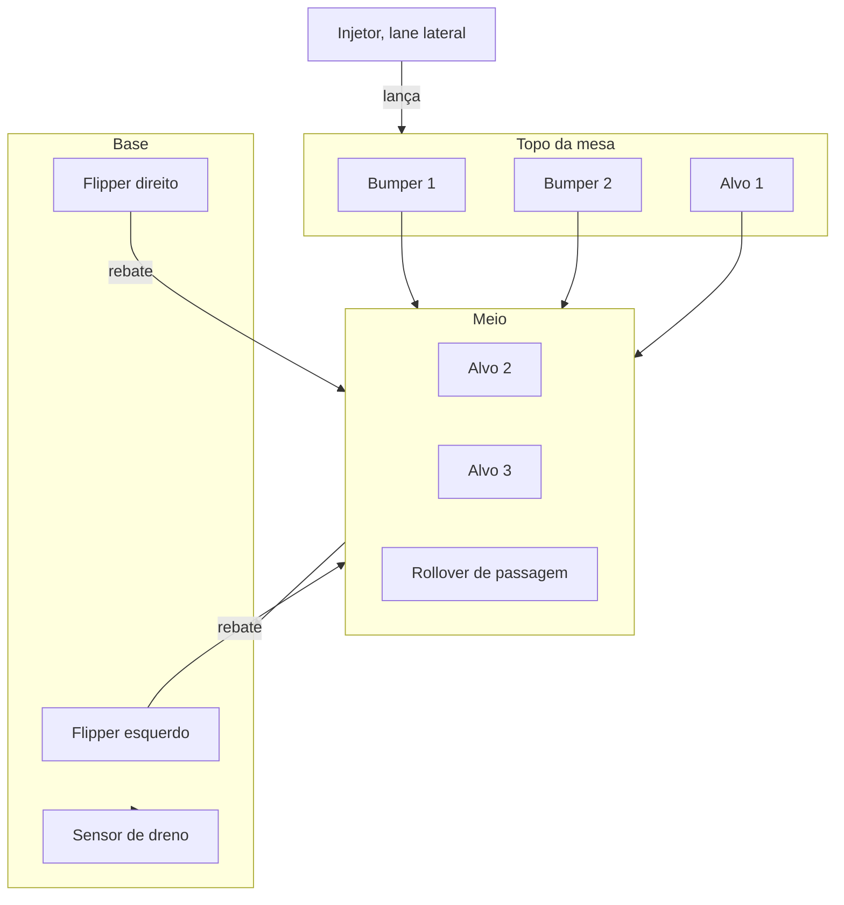

[Voltar ao índice](../README.md)

# 13. Design do playfield

Como projetar o jogo em si: por onde a bola corre, onde ela bate, o que pontua e o que faz a partida
ser divertida. Este é o passo que vem antes do circuito, porque é dele que sai a contagem de
componentes.

## 13.1 O ponto de partida é diferente do usual

Num projeto de pinball comum, desenha-se o playfield no papel e depois se constrói a mesa. Aqui a
mesa já existe, com arte montada e furos feitos. Isso é uma vantagem e uma restrição ao mesmo tempo.

A vantagem é que boa parte das decisões de posição já foi tomada, e os furos indicam a intenção
original. A restrição é que furar de novo em MDF pintado estraga o acabamento, então vale trabalhar
com o que está lá sempre que possível.

Por isso o método recomendado aqui começa pela mesa física, não pelo software.

## 13.2 Comece rolando a bola

Antes de qualquer desenho, faça este teste. Ele custa nada e vale mais que qualquer simulação.

1. Apoie a mesa na inclinação de trabalho, entre 6 e 7 graus. Use calços e confira com um app de
   nível do celular.
2. Solte a bola de aço de vários pontos do topo e observe por onde ela desce.
3. Filme de cima, com o celular preso em algo alto.
4. Repita umas vinte vezes, soltando de posições diferentes.

O que se aprende com isso, e que nenhum desenho revela:

- Quais caminhos a bola percorre naturalmente
- Onde ela ganha e onde perde velocidade
- Se existe algum ponto onde ela trava ou fica presa
- Quanto tempo dura uma descida sem obstáculo, que é o ritmo base do jogo

Anote tudo. Esse mapa de trajetórias naturais é a base do design, porque projetar um pinball é, no
fundo, decidir onde interferir nessas trajetórias.

## 13.3 As medidas desta mesa

A caixa foi medida em 13/08: **450 mm de largura por 900 mm de comprimento**.

Isso é uma boa notícia. Um playfield comercial Williams ou Bally tem 515 x 1067 mm, então esta mesa
está em cerca de **86% da escala real**, e não é uma miniatura. As proporções comerciais podem ser
aproveitadas quase direto, aplicando o fator de escala.

| Item | Comercial | Escalado 0,86 | Adotar |
|---|---|---|---|
| Playfield | 515 x 1067 mm | 450 x 900 mm | medido |
| Flipper | 76 mm | 65 mm | **65 mm**, impresso em 3D |
| Bola | 27 mm | 23 mm | ver observação abaixo |
| Corpo do bumper | 75 mm | 64 mm | **65 mm** |
| Largura de lane | 35 mm | 30 mm | **30 mm** |
| Eixo do flipper ao fundo | 100 mm | 86 mm | **90 mm** |

**Sobre a bola.** A escala pede 23 mm, mas 27 mm é o tamanho padrão e o mais fácil de encontrar.
Usar 27 mm numa mesa escalada deixa o jogo proporcionalmente mais apertado, o que aumenta a
dificuldade. Uma esfera de rolamento de 22 ou 25 mm fica mais proporcional e costuma ser barata.
Meçam a bola que já têm antes de decidir, porque esse número afeta o vão entre os flippers.

**Inclinação.** O ângulo não escala, continua entre 6 e 7 graus. Em 900 mm de comprimento, isso dá
o desnível entre o topo e a base:

| Ângulo | Desnível |
|---|---|
| 6 graus | 95 mm |
| 6,5 graus | 103 mm |
| 7 graus | 111 mm |

Ou seja, o topo da mesa fica cerca de 10 cm mais alto que a base. Vale conferir se o gabinete
comporta isso antes de fixar os pés.

**Geometria dos flippers.** Com pá de 65 mm em repouso a 30 graus abaixo da horizontal, a projeção
horizontal de cada uma é 56 mm. Para um vão de 40 mm entre as pontas, a distância entre os eixos
fica em **153 mm**, centrada na largura da mesa. Os eixos ficam a 90 mm da borda inferior.

**Divisão em zonas.** Os 900 mm em três terços dão um ponto de partida para distribuir os elementos:

| Faixa | Zona | O que costuma ficar ali |
|---|---|---|
| 0 a 300 mm | Superior | Bumpers e alvos altos |
| 300 a 600 mm | Média | Alvos, caminhos e rampas |
| 600 a 900 mm | Inferior | Flippers, slingshots e dreno |

### Gabarito pronto para desenhar

O arquivo [`docs/assets/gabarito-playfield.svg`](assets/gabarito-playfield.svg) traz tudo isso
desenhado em escala 1:1, e foi gerado por
[`tools/gerar_gabarito_playfield.py`](../tools/gerar_gabarito_playfield.py).

```bash
python3 tools/gerar_gabarito_playfield.py
```

Se a área interna útil for menor que a caixa, por causa das paredes do gabinete, passe as medidas
internas:

```bash
python3 tools/gerar_gabarito_playfield.py --largura 410 --comprimento 860
```

O arquivo abre no Inkscape já com as dimensões físicas corretas e vem em camadas separadas: grade de
10 mm, zonas, geometria dos flippers com o vão e a bola em escala, cotas, e uma camada **proposta**
vazia, que é onde vocês desenham. As camadas de referência ficam intactas.

Para imprimir em tamanho real, use Arquivo, Imprimir, sem ajuste de escala, e monte as folhas A4 lado
a lado. Aí é só apoiar sobre a mesa e conferir se as posições batem com os furos que já existem.

## 13.4 Geometria de referência

Valores das máquinas comerciais, para consulta. As medidas já escaladas para esta mesa estão na
seção anterior.

| Parâmetro | Valor comercial | Observação |
|---|---|---|
| Playfield | 515 mm x 1067 mm | Meça a mesa do projeto e calcule a proporção |
| Inclinação | 6 a 7 graus | Abaixo disso o jogo fica lento, acima fica incontrolável |
| Bola | 27 mm de diâmetro, aço | Confira a que vocês têm, o tamanho muda tudo |
| Flipper | 76 mm | Existe versão de 51 mm para mesas menores |
| Ângulo de repouso do flipper | 30 a 35 graus abaixo da horizontal | Define o alcance |
| Curso do flipper | Cerca de 45 graus | Do repouso ao acionado |
| Vão entre as pontas dos flippers | 1,5 a 2 diâmetros de bola | O ponto mais crítico de todos |

Sobre o vão entre os flippers, que é a decisão de dificuldade mais importante do projeto: vão
apertado torna o jogo fácil e sem graça, porque a bola quase nunca dreena. Vão largo torna o jogo
frustrante. Comece com cerca de 1,5 diâmetro de bola e ajuste depois de jogar.

## 13.5 Os elementos e o que cada um faz

Entender a função de cada elemento é o que permite escolher onde colocá-lo.

| Elemento | O que faz | Onde costuma ficar | I/O que consome |
|---|---|---|---|
| **Flipper** | Rebate a bola sob controle do jogador | Base, em par | 1 entrada (botão) e 1 saída (solenoide) cada |
| **Injetor** | Coloca a bola em jogo | Lane lateral, geralmente à direita | 1 saída |
| **Bumper** | Repele a bola ativamente e pontua | Topo, em grupo de 2 ou 3 | 1 entrada e 1 saída cada |
| **Alvo fixo** | Pontua ao ser atingido | Espalhados, em pontos de passagem | 1 entrada cada |
| **Slingshot** | Chuta a bola de volta ao campo | Acima dos flippers, nas laterais | 1 entrada e 1 saída cada |
| **Rollover** | Detecta passagem por um caminho | Lanes de entrada e saída | 1 entrada cada |
| **Dreno** | Detecta que a bola foi perdida | Entre os flippers, abaixo | 1 entrada |
| **Poste com borracha** | Desvia a bola, sem eletrônica | Onde precisar guiar | Nenhum |
| **Guia** | Define caminhos | Laterais e rampas | Nenhum |

Dois pontos que valem destaque.

**Postes e guias custam zero de I/O** e são a forma mais barata de tornar o jogo interessante. Antes
de acrescentar mais um elemento eletrônico, veja se um poste bem posicionado não resolve.

**O dreno precisa de sensor.** Sem ele o software não sabe que a bola foi perdida e a partida nunca
termina. É o sensor mais importante do jogo e o mais fácil de esquecer.

## 13.6 Princípios de um bom layout

**Toda bola precisa poder voltar.** O erro mais comum em pinball caseiro é criar uma região de onde a
bola não retorna aos flippers. Ao posicionar cada elemento, pergunte para onde ele manda a bola.

**Não deixe áreas mortas.** Regiões onde a bola passa devagar e sem nada acontecer entediam. Se o
teste da seção 13.2 mostrar uma área que a bola atravessa sem interesse, coloque algo lá ou feche a
área com uma guia.

**Simetria não é obrigatória.** Mesas comerciais são bem assimétricas de propósito, porque isso cria
caminhos com dificuldades diferentes e dá o que aprender ao jogador.

**Recompense o tiro difícil.** Um alvo fácil de acertar vale pouco, um difícil vale muito. É o que
faz o jogador querer melhorar.

**Dê retorno imediato.** Toda ação precisa de resposta visível e audível na hora. Luz que acende, som
que toca, pontuação que sobe. Sem isso, o jogador não entende o que fez.

**O topo é área de acúmulo.** Bumpers no topo prendem a bola por alguns segundos, gerando pontos e
movimento imprevisível. É o que dá emoção sem exigir habilidade.

## 13.7 Ferramentas para desenhar

Em ordem de utilidade para o caso de vocês, que já têm a mesa pronta.

### Foto em vista superior mais Inkscape

O caminho mais prático. Fotografe a mesa de cima, o mais perpendicular possível, com uma régua no
enquadramento para dar escala. Importe no **Inkscape**, que é gratuito e livre, ajuste a escala pela
régua e desenhe por cima: trajetórias em uma camada, elementos em outra, furos existentes em uma
terceira.

A vantagem é trabalhar sobre a mesa real, com os furos que existem de verdade, em escala. Dá para
imprimir em tamanho real e conferir sobre a mesa antes de furar qualquer coisa.

### Papel manteiga sobre a mesa

Mais rápido ainda para a primeira iteração. Cubra a mesa com papel, marque os furos existentes,
desenhe as posições candidatas e teste rolando a bola por cima. Zero de software e a escala é exata
por construção.

Não subestime. Muito projeto de pinball caseiro nasce assim, e é o método que permite iterar em
minutos em vez de horas.

### Visual Pinball X

Simulador de pinball gratuito, usado pela comunidade para recriar mesas reais. Permite montar um
playfield virtual com física de verdade e **jogar antes de construir**. É a única forma de sentir se
o layout é divertido sem montar nada.

O custo é a curva de aprendizado, que não é pequena, e o fato de que a mesa de vocês teria que ser
remodelada lá dentro. Vale se sobrar tempo, ou se alguém do grupo se interessar pela ferramenta.

### Ferramentas que não recomendo aqui

**Tinkercad 3D e Fusion 360** servem para modelar peças, não para projetar jogabilidade. Úteis mais
adiante, quando for imprimir um suporte de bumper.

**draw.io e Figma** funcionam para o diagrama de blocos do circuito, mas não têm noção de escala
física, o que atrapalha num desenho onde milímetros importam.

## 13.8 Regras do jogo

O layout define onde a bola bate. As regras definem o que isso significa. Vale escrever antes de
programar.

Comece pela pontuação, que é a parte mais simples:

| Evento | Pontos | Justificativa |
|---|---|---|
| Bumper atingido | | Fácil de acontecer, vale pouco |
| Alvo fixo atingido | | Exige mira |
| Sequência de alvos completa | | Recompensa objetivo cumprido |
| Rampa completada | | Tiro difícil, vale muito |

Depois defina a estrutura da partida:

- Quantas bolas por partida, o padrão é três
- O que acontece ao completar um conjunto de alvos, por exemplo acender uma luz e valer bônus
- Se existe bola extra, e como se ganha
- Se há bônus de fim de bola, somando o que foi acumulado

E o modo de atração, que é o estado da máquina parada: luzes piscando em padrão, e talvez a maior
pontuação em exibição. É o que convida alguém a jogar, e numa feira isso faz diferença real.

Uma sugestão de escopo: comece com pontuação simples e três bolas. Modos de jogo, multiball e bônus
progressivo são ótimos, mas só valem depois que a máquina estiver funcionando de ponta a ponta.

## 13.9 Template do layout

Preencha conforme o desenho for fechando. Esta tabela alimenta diretamente a contagem de I/O da
[seção 12.6](12-projeto-novo-do-circuito.md#126-passo-2-contagem-de-io).

| Nº | Elemento | Posição na mesa | Aproveita furo existente | Entradas | Saídas | Pontos |
|---|---|---|---|---|---|---|
| 1 | | | | | | |
| 2 | | | | | | |
| 3 | | | | | | |
| 4 | | | | | | |
| 5 | | | | | | |
| 6 | | | | | | |
| 7 | | | | | | |
| 8 | | | | | | |

Ao final, some as colunas de entradas e saídas. Esses dois números são o que define o circuito.

## 13.10 Sugestão de layout mínimo

Um ponto de partida que entrega um pinball completo e cabe no tempo restante. Ajuste conforme o
teste da bola mostrar o que a mesa pede.



A conta de I/O desse layout mínimo:

| Item | Quantidade | Entradas | Saídas |
|---|---|---|---|
| Flippers | 2 | 2 botões | 2 solenoides |
| Bumpers | 2 | 2 sensores | 2 solenoides |
| Alvos fixos | 3 | 3 sensores | 0 |
| Rollover | 1 | 1 sensor | 0 |
| Injetor | 1 | 0 | 1 solenoide |
| Dreno | 1 | 1 sensor | 0 |
| Botão de início | 1 | 1 | 0 |
| Luzes | a definir | 0 | a definir |
| **Total** | | **10 entradas** | **5 solenoides** |

Dez entradas cabem folgadas nos GPIOs da Raspberry Pi, sem precisar de expansor para leitura. Cinco
solenoides significam cinco MOSFETs com seus diodos. É um projeto bem mais enxuto que o anterior, que
previa dez solenoides, e entrega a mesma experiência de jogo.

---

Anterior: [12. Projeto novo do circuito](12-projeto-novo-do-circuito.md)
